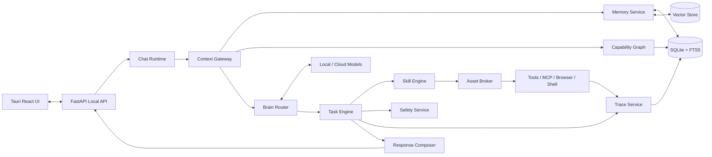

# 开发设计

## 工程目标

工程目标是做出一套单机可运行、后续可扩展的个人智能体操作系统，而不是一次性把所有未来能力都塞进 MVP。

核心要求：

```text
本地可启动
本地可存储
本地可降级
聊天链路可追踪
任务执行可恢复
记忆写入可回溯
工具调用可审计
插件能力可隔离
壳系统可配置
后续可接云模型
```

## 推荐技术栈

| 层 | 技术 | 说明 |
|---|---|---|
| 桌面端 | Tauri + React + TypeScript | 体积小，适合本地桌面应用 |
| UI 状态 | Zustand 或 TanStack Store | 简单、可控、适合桌面端 |
| 本地 API | Python + FastAPI + Pydantic | 适合 Agent 编排、工具调用和模型适配 |
| 主数据 | SQLite + FTS5 | 单机零运维，适合结构化数据和全文检索 |
| 向量检索 | Chroma PersistentClient 或同类本地向量库 | 用于记忆和知识库语义召回 |
| 模型路由 | OpenAI-compatible adapter | 本地 Ollama/vLLM 和云模型统一协议 |
| 浏览器执行 | Playwright + Playwright MCP | 页面操作、快照、trace 回放 |
| 本地命令 | 受控 shell runner | 只通过 Task/Safety 层执行 |
| 沙箱 | Docker、WSL2 或 OS sandbox | 高风险脚本和插件隔离 |
| 家居设备 | Home Assistant REST/WebSocket/MCP | 后续接入智能家居 |
| 测试 | pytest、Playwright、Vitest | 分层测试 |
| 代码质量 | Ruff、mypy、ESLint、TypeScript strict | 保证 AI 生成代码可维护 |

## 系统分层

```text
apps
  desktop-tauri      桌面 UI
  local-api          本地 FastAPI 服务

services
  chat-runtime       聊天请求编排
  context-gateway    上下文组装
  brain              意图、规划、模型路由
  heart              情绪和关系姿态
  persona-engine     人格和壳映射
  memory             记忆写入、检索、冲突
  task-engine        任务规划、执行、恢复
  skill-engine       Skill 解析、匹配、运行
  asset-broker       资产句柄、资源查询、凭证隔离
  capability-graph   权限和能力图
  tools              文件、浏览器、终端、设备工具
  safety             风险分级、确认、DLP、沙箱
  response-composer  回复结构化编排
  trace              span、日志、回放

packages
  core-types         跨前后端类型
  schemas            JSON schema 和 Pydantic schema
  shell-runtime      壳映射和模板加载
  evals              回归评测数据和评分器
```

## 运行时架构



## 本地启动流程

1. Tauri 启动桌面端。
2. 桌面端检查本地 API 是否运行。
3. 如果未运行，启动 `apps/local-api`。
4. API 加载配置：
   - `config/app.yaml`
   - `config/model-routing.yaml`
   - `shells/company/*.yaml`
   - `bundles/core-skills/**`
5. 初始化 SQLite migration。
6. 初始化向量库。
7. 检查本地模型服务连接。
8. 检查 MCP 服务配置。
9. UI 进入欢迎页或聊天页。

## 推荐项目结构

```text
agent-os/
  apps/
    desktop-tauri/
      src/
        app/
        pages/
          chat/
          members/
          organization/
          assets/
          tasks/
          settings/
        components/
        stores/
        api/
        styles/
      src-tauri/
        tauri.conf.json
        src/
    local-api/
      app/
        main.py
        api/
          routes_chat.py
          routes_members.py
          routes_assets.py
          routes_tasks.py
          routes_settings.py
        core/
          config.py
          logging.py
          lifespan.py
        db/
          migrations/
          session.py
        schemas/
        services/
        workers/
      tests/
  services/
    chat-runtime/
    context-gateway/
    brain/
    heart/
    persona-engine/
    memory/
    task-engine/
    skill-engine/
    asset-broker/
    capability-graph/
    tools/
      file/
      browser/
      terminal/
      device/
      mcp/
    safety/
    response-composer/
    trace/
  packages/
    core-types/
    shell-runtime/
    evals/
  bundles/
    core-skills/
      file-organize/
      browser-research/
      code-assistant/
      content-writing/
    company-shell/
  shells/
    company/
      shell.yaml
      menus.yaml
      terms.yaml
      departments.yaml
      roles.yaml
      member_templates.yaml
      prompts/
    imperial_court/
      shell.yaml
  data/
    sqlite/
    chroma/
    traces/
    artifacts/
  config/
    app.yaml
    model-routing.yaml
    safety.yaml
    mcp.yaml
  docs/
  tests/
    e2e/
    evals/
    fixtures/
  AGENTS.md
```

## 服务职责

### Chat Runtime

职责：

```text
接收聊天请求
建立 turn 上下文
发起 trace
调用 Context Gateway
调用 Brain 选择模式
调度 Task 或直接回复
输出流式事件
触发记忆写入
完成任务收尾
```

它不直接访问文件、浏览器、终端、数据库明文凭证。

### Context Gateway

职责：

```text
收集当前会话摘要
检索相关长期记忆
查询成员人格和壳映射
查询可用能力摘要
查询资源句柄摘要
压缩工具结果
标记外部不可信内容
生成模型上下文包
```

关键原则：

```text
只放必要上下文
只放摘要和句柄
不放明文密钥
不放无关组织全量数据
不把网页内容当用户指令
```

### Brain

Brain 不是单个模型，而是决策层：

| 子模块 | 职责 |
|---|---|
| Intent Classifier | 判断聊天、查询、创作、任务、配置、记忆修正 |
| Mode Selector | 选择 direct、workflow、agent、supervisor |
| Planner | 生成步骤、成功标准、风险点 |
| Model Router | 选择本地快模型、本地主模型、云强模型 |
| Reflection | 任务后复盘，生成记忆和 Skill 候选 |

### Heart

Heart 负责让回复像人：

```text
识别用户情绪
判断对话节奏
选择温度、幽默、简洁度
控制拟人程度
在高影响场景降温
```

Heart 不负责做事实判断，也不负责安全放行。

### Persona Engine

Persona Engine 管理稳定身份：

```text
人格模板
语气模板
关系阶段
壳标签映射
聊天风格
成员自我介绍
```

### Memory

Memory 服务分层：

| 层 | 名称 | 作用 |
|---|---|---|
| L0 | Working Memory | 当前 turn 临时变量 |
| L1 | Session Memory | 当前会话摘要、短任务状态 |
| L2 | Episodic Memory | 事件、任务经历、对话片段 |
| L3 | Semantic Memory | 稳定偏好、长期事实 |
| L4 | Procedural Memory | Skill 线索、流程经验 |
| L5 | Asset Memory | 资产索引、知识库摘要 |
| L6 | Temporal Relation Memory | 事实随时间变化的版本关系 |

### Task Engine

职责：

```text
创建任务
生成计划
执行 workflow
执行 agent loop
暂停和恢复
处理重试
等待用户确认
保存工件
写 trace
交给 Response Composer 汇总
```

### Skill Engine

职责：

```text
扫描 Skill 包
解析 bundle.yaml 和 SKILL.md
匹配用户意图和任务计划
加载 prompt、脚本和 MCP 配置
执行前做权限预检
执行后产出结果和评测数据
沉淀候选 Skill
```

### Asset Broker

职责：

```text
管理大脑、账号、钱包、硬件、知识库
发放资源句柄
隔离明文密钥
验证资产是否过期
查询资产可用 Skill
把资源访问写入审计
```

Asset Broker 是模型和真实资源之间的隔离层。模型不直接拿密码和本地敏感路径。

### Capability Graph

职责：

```text
判断主体能否使用资源
判断动作是否允许
合并组织、部门、成员、Skill、资产策略
输出 approval requirement
输出 deny reason
```

权限优先级：

```text
系统安全策略 > 用户显式禁用 > 成员个人权限 > 部门权限 > 组织默认权限
```

### Safety

职责：

```text
风险分级
确认策略
外发审查
敏感信息检测
prompt injection 防护
沙箱策略
高风险工具拦截
审计记录
```

### Response Composer

职责：

```text
把执行结果变成高质量回复
选择标题、摘要、表格、列表、代码块
插入必要确认按钮
控制语气和篇幅
解释已经做了什么
说明还需要用户确认什么
```

## 模型路由设计

模型路由要支持本地优先和多供应商适配。

| 路由 | 适用任务 | 推荐来源 |
|---|---|---|
| local_fast | 意图识别、格式化、记忆抽取 | 本地小模型 |
| local_main | 日常聊天、普通总结、轻任务 | 本地 7B-14B |
| cloud_strong | 复杂规划、高质量写作、复杂代码 | 云端强模型 |
| tool_specialized | 视觉、语音、代码执行 | 专项工具或模型 |

路由输入：

```text
任务类型
隐私等级
用户成本预算
延迟预算
上下文长度
是否需要工具
是否需要强推理
```

路由输出：

```json
{
  "route": "cloud_strong",
  "reason": "complex_planning",
  "privacy_level": "medium",
  "max_tokens": 6000,
  "temperature": 0.4,
  "fallback": "local_main"
}
```

## 配置文件

### app.yaml

```yaml
app:
  mode: local_first
  default_shell: company
  data_dir: ./data
  trace_level: standard

desktop:
  auto_start_api: true
  api_port: 8765

storage:
  sqlite_path: ./data/sqlite/app.db
  vector_path: ./data/chroma
  artifact_path: ./data/artifacts
```

### model-routing.yaml

```yaml
routing:
  default: local_main
  privacy:
    high:
      allow_cloud: false
      route: local_main
    medium:
      allow_cloud: true
      route: local_main
      fallback: cloud_strong
    low:
      allow_cloud: true
      route: cloud_strong
  tasks:
    intent_classify: local_fast
    memory_extract: local_fast
    daily_chat: local_main
    planning: cloud_strong
    code: cloud_strong
    response_compose: local_fast
```

### safety.yaml

```yaml
risk:
  require_confirmation:
    - file_delete
    - file_overwrite
    - external_post
    - payment
    - wallet_sign
    - system_setting_change
    - install_program
    - send_sensitive_data
  deny_paths:
    - ~/.ssh/**
    - ~/.gnupg/**
    - ~/.config/*/secrets/**
    - browser_profile://default/**
  sandbox:
    high_risk_tools: docker
```

## 任务执行模式

| 模式 | 适用 | 特点 |
|---|---|---|
| direct | 普通聊天、问答、轻总结 | 不创建复杂任务 |
| workflow | 固定步骤任务 | 可预测、易回放 |
| agent | 搜索、探索、需要动态决策 | 灵活但成本高 |
| supervisor | 多成员、多角色协作 | 由主持成员调度 |

默认规则：

```text
能 workflow 就不 agent
能单成员完成就不多成员
高风险先 plan 再执行
长任务必须可暂停和恢复
```

## 错误处理

| 错误 | 处理 |
|---|---|
| 模型超时 | 降级到 fallback 模型，保留 trace |
| 工具失败 | 重试有限次数，失败后解释原因 |
| 权限不足 | 说明缺少什么授权，引导到对应管理页 |
| 资产过期 | 标记资产不可用，提示更新 |
| MCP 断开 | 停用相关工具，任务可降级 |
| 记忆冲突 | 不覆盖旧记忆，生成 supersede 关系 |
| 用户取消 | 任务进入取消状态，工件保留 |

## 开发验收

| 层 | 验收标准 |
|---|---|
| UI | 页面可打开，聊天页无组织/壳信息，管理页完整 |
| API | OpenAPI schema 可生成，核心接口有测试 |
| DB | migration 可重复执行，关键表有索引 |
| Memory | 偏好跨会话可召回，可纠错 |
| Task | 任务可创建、暂停、恢复、回放 |
| Safety | 高风险动作必须阻断到确认 |
| Trace | 每次模型调用和工具调用有 span |
| Skill | bundle 可安装、启停、执行 |
| MCP | 服务可配置、连接、列工具 |
| Evals | 聊天、记忆、执行、安全有最小回归集 |

