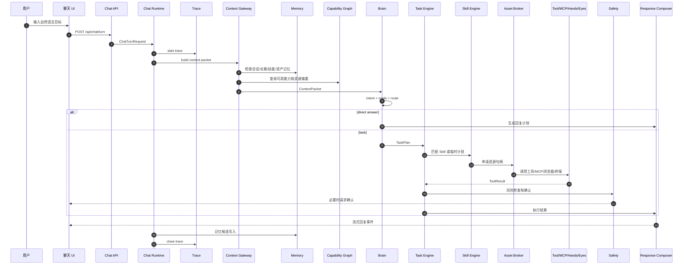

# 聊天主链路最终设计

## 目标

聊天主链路是整个系统的核心。它必须同时满足：

```text
聊天自然
回复质量高
记忆召回准
任务能执行
工具可控
多成员可协作
高风险可确认
过程可回放
结果可沉淀
失败可恢复
```

主链路不是“用户输入直接丢给模型”。它是一条经过上下文、记忆、能力、模型、任务、安全、回复编排和记忆回写的完整管线。

## 总体链路



## 请求入口

### API

```http
POST /api/chat/turn
```

请求：

```json
{
  "session_id": "ses_001",
  "member_id": "mem_xiaoyao",
  "conversation_id": "conv_001",
  "input": {
    "type": "text",
    "text": "帮我把这个项目做成技术方案"
  },
  "attachments": [],
  "client_context": {
    "timezone": "Asia/Shanghai",
    "locale": "zh-CN",
    "ui_mode": "chat"
  }
}
```

响应采用事件流或 WebSocket：

```text
turn.started
context.ready
thinking.started
task.created
tool.started
tool.completed
approval.required
response.delta
response.completed
memory.write_scheduled
turn.completed
```

## 事件流协议

### response.delta

```json
{
  "event": "response.delta",
  "turn_id": "turn_001",
  "text": "我先把目标拆成三部分："
}
```

### task.created

```json
{
  "event": "task.created",
  "task_id": "tsk_001",
  "title": "生成项目技术方案",
  "mode": "supervisor",
  "status": "planning"
}
```

### approval.required

```json
{
  "event": "approval.required",
  "approval_id": "apr_001",
  "risk_level": "R4",
  "action": "external_post",
  "summary": "即将使用小红书主账号发布草稿",
  "options": ["approve", "deny", "edit"]
}
```

## Context Gateway

Context Gateway 是链路最重要的闸门之一。

### 输入

```text
当前用户输入
当前成员 ID
当前会话 ID
当前组织 ID
当前壳 ID
客户端上下文
近期消息
附件元数据
```

### 输出

```json
{
  "context_packet_id": "ctx_001",
  "member": {
    "id": "mem_xiaoyao",
    "display_name": "小曜",
    "persona_summary": "可靠、温暖、擅长统筹"
  },
  "shell": {
    "id": "company",
    "visible_labels": {
      "member": "员工",
      "department": "部门",
      "role": "岗位"
    }
  },
  "conversation": {
    "recent_summary": "用户正在设计个人智能体 OS",
    "last_messages": []
  },
  "memories": [],
  "capabilities": [],
  "resource_handles": [],
  "safety_notes": [],
  "untrusted_context": []
}
```

### 检索顺序

1. Pinned Persona：成员稳定人格和系统身份。
2. Session Memory：当前会话摘要。
3. Semantic Memory：用户偏好、项目事实。
4. Episodic Memory：相关历史任务和对话。
5. Procedural Memory：可能相关的 Skill。
6. Asset Memory：资源摘要和可用句柄。
7. External Context：附件、网页、工具返回，但必须标记为不可信。

### 关键规则

```text
记忆以摘要进入上下文，不塞原始长文本
资产以句柄进入上下文，不暴露明文密钥
组织信息按需进入，不全量注入
壳信息只注入标签映射，不改变底层数据
外部网页、PDF、邮件、工具输出一律标记 untrusted
```

## 意图识别

Intent Classifier 输出：

```json
{
  "intent": "task_create",
  "sub_intents": ["product_design", "technical_architecture"],
  "confidence": 0.91,
  "needs_memory": true,
  "needs_tools": true,
  "needs_approval": false,
  "candidate_members": ["mem_xiaoyao", "mem_ningning", "mem_aheng"]
}
```

意图枚举：

```text
chat
question_answer
creative_writing
summarization
task_create
task_continue
task_status
memory_query
memory_update
asset_query
system_setting
member_management
organization_management
```

## 模式选择

Mode Selector 根据意图选择：

| 模式 | 条件 | 示例 |
|---|---|---|
| direct | 不需要工具和持久任务 | 普通聊天、解释概念 |
| direct_with_memory | 需要记忆但不执行 | “我上次说的那个项目是什么” |
| workflow | 步骤固定，结果可验证 | 整理文件、生成日报 |
| agent | 需要搜索、探索、动态判断 | 调研竞品 |
| supervisor | 多成员协作 | 产品方案 + 技术方案 + 运营方案 |

模式选择必须可解释并写入 trace。

## 模型路由

Model Router 输出：

```json
{
  "primary": "cloud_strong",
  "fallback": "local_main",
  "reason": "complex_task_planning",
  "privacy_policy": "allow_cloud_without_secrets",
  "context_budget": {
    "max_input_tokens": 24000,
    "reserved_output_tokens": 6000
  }
}
```

隐私规则：

```text
包含密码、密钥、钱包助记词、敏感本地路径时禁止云端
高风险执行计划可以用云模型规划，但工具参数必须脱敏
用户可在系统管理中关闭云 fallback
```

## 任务计划

TaskPlan 示例：

```json
{
  "task_id": "tsk_tech_plan",
  "mode": "supervisor",
  "goal": "把项目做成技术方案",
  "owner_member_id": "mem_xiaoyao",
  "participants": [
    {"member_id": "mem_ningning", "role": "product_context"},
    {"member_id": "mem_aheng", "role": "technical_architecture"}
  ],
  "success_criteria": [
    "明确产品目标和边界",
    "给出系统架构",
    "给出模块划分",
    "给出数据模型",
    "给出开发路线图"
  ],
  "steps": [
    {"id": "s1", "type": "memory_recall", "owner": "mem_xiaoyao"},
    {"id": "s2", "type": "subtask", "owner": "mem_ningning"},
    {"id": "s3", "type": "subtask", "owner": "mem_aheng"},
    {"id": "s4", "type": "compose", "owner": "mem_xiaoyao"}
  ],
  "risk_level": "R1"
}
```

## 多成员协作

多成员不能变成角色扮演闲聊。必须有主持人和轮数限制。

### 协作模式

| 模式 | 用途 | 规则 |
|---|---|---|
| 串行协作 | 产品到技术到运营 | 上一步输出成为下一步输入 |
| 并行协作 | 多方向方案 | 子任务并行，主持人汇总 |
| 评审协作 | 检查质量 | 一个成员产出，另一个成员评审 |
| 辩论协作 | 重大取舍 | 每人最多一轮，必须结论收束 |
| 主持汇总 | 默认模式 | 小曜或主成员最终组织输出 |

### 子任务注入

子成员只拿到完成任务必要的信息：

```text
任务目标
自己的角色
相关上下文摘要
允许使用的工具和资源
输出格式
安全约束
```

不把其他成员私有记忆、无关资产和完整系统状态注入给它。

## Skill 匹配

Skill Engine 根据以下信号匹配：

```text
用户意图
任务类型
成员默认技能
部门默认技能
资产绑定技能
历史成功 Skill
用户偏好
风险等级
```

匹配结果：

```json
{
  "skill_id": "skill.product_tech_plan",
  "version": "0.1.0",
  "confidence": 0.83,
  "required_assets": ["knowledge.project_docs"],
  "required_tools": ["memory.search", "file.write"],
  "approval_requirements": []
}
```

如果没有合适 Skill：

1. 生成临时计划。
2. 执行任务。
3. 成功后生成 Skill 候选。
4. 用户确认后沉淀为正式 Skill。

## 资源感知与工具调用

资源感知路径：

```text
Task Engine
  -> Skill Engine
  -> Asset Broker
  -> Capability Graph
  -> Resource API / MCP / Tool
```

模型只能看到：

```text
资源摘要
资源句柄
允许动作
风险说明
```

不能看到：

```text
明文密码
密钥
钱包私钥
浏览器主 profile cookie
系统敏感文件
未授权资产
```

## Safety Gate

Safety Gate 至少在三个位置出现：

1. 计划前：判断任务是否需要先问用户。
2. 执行前：拦截高风险工具调用。
3. 输出前：检查是否外发敏感信息或误导用户。

风险级别：

| 级别 | 行为 | 策略 |
|---|---|---|
| R0 | 闲聊、解释 | 自动 |
| R1 | 读取授权知识库 | 自动 |
| R2 | 写入新文件 | 自动或轻提示 |
| R3 | 覆盖文件、批量移动 | 确认 |
| R4 | 登录后提交、发帖 | 确认 |
| R5 | 删除、执行脚本、系统修改 | 强确认 |
| R6 | 支付、转账、外发敏感信息 | 强确认 + 审计 |
| R7 | 钱包签名、持久系统级改动 | 二次确认 + 强审计 |

## Response Composer

Response Composer 输入：

```text
用户原始问题
任务计划
执行结果
工具结果
安全状态
Heart 语气建议
Persona 身份约束
用户偏好
```

输出 ResponsePlan：

```json
{
  "style": "result_first",
  "sections": [
    {"type": "title", "text": "技术方案已整理好"},
    {"type": "summary", "text": "我把它拆成产品边界、系统架构、数据模型和开发路线。"},
    {"type": "table", "title": "模块拆分", "rows": []},
    {"type": "actions", "actions": ["继续细化 API", "生成开发任务"]}
  ],
  "tone": {
    "warmth": 0.6,
    "humor": 0.15,
    "directness": 0.75
  }
}
```

规则：

```text
结论先行
不要暴露内部 prompt
不要把工具原始大段输出直接贴给用户
表格用于比较和结构化
高风险确认必须清楚说明影响
失败时解释原因和下一步
```

## 记忆回写

每轮结束后不是直接把整段对话写入长期记忆，而是生成候选。

候选类型：

```text
user_preference
project_fact
relationship_signal
task_experience
skill_candidate
asset_usage_pattern
correction
```

写入流程：

1. 提取候选。
2. 评分：
   - 稳定性
   - 价值
   - 可验证性
   - 敏感度
   - 是否重复
3. 与旧记忆做冲突检查。
4. 写入 memory_items。
5. 必要时生成 supersede。
6. 在 trace 中记录来源。

## Trace 设计

每个 turn 必须生成 trace：

```json
{
  "trace_id": "trc_001",
  "turn_id": "turn_001",
  "session_id": "ses_001",
  "spans": [
    {"type": "context.build", "latency_ms": 42},
    {"type": "memory.search", "hits": 8},
    {"type": "model.call", "route": "cloud_strong"},
    {"type": "task.plan", "mode": "supervisor"},
    {"type": "tool.call", "tool": "file.write"},
    {"type": "response.compose"},
    {"type": "memory.write"}
  ]
}
```

Trace 必须支持：

```text
任务回放
错误定位
成本统计
延迟统计
模型路由审计
工具调用审计
审批历史
评测回归
```

## 文件与目录建议

```text
apps/local-api/app/api/routes_chat.py
apps/local-api/app/schemas/chat.py
services/chat-runtime/runtime.py
services/chat-runtime/events.py
services/context-gateway/builder.py
services/context-gateway/retrieval.py
services/brain/intent.py
services/brain/mode_selector.py
services/brain/model_router.py
services/task-engine/planner.py
services/task-engine/runner.py
services/task-engine/supervisor.py
services/skill-engine/registry.py
services/skill-engine/matcher.py
services/asset-broker/broker.py
services/capability-graph/policy.py
services/safety/risk.py
services/safety/approval.py
services/response-composer/composer.py
services/memory/writer.py
services/memory/retriever.py
services/trace/tracer.py
```

## 容易出错点

| 问题 | 后果 | 解决 |
|---|---|---|
| 直接把用户输入丢给模型 | 上下文乱、无法审计 | 必须通过 Chat Runtime |
| 记忆全量塞上下文 | 污染、成本高 | Context Gateway 检索和压缩 |
| 智能体默认知道全组织 | 越权、拟人混乱 | 默认独立，按需资源句柄 |
| Skill 承担资源发现 | Skill 变成混乱脚本 | 资源发现交给 Asset Broker |
| 所有任务都走 agent | 慢、贵、不可控 | workflow 优先 |
| 回复直接展示模型原文 | 质量不稳定 | Response Composer 统一编排 |
| 高风险靠 prompt 约束 | 真实执行危险 | Safety Gate 和 Approval API |
| 没有 trace | 无法调试 | 每个 turn 必须有 span |

## MVP 验收用例

1. 用户普通聊天，系统 direct 回复，写入 trace。
2. 用户让系统记住偏好，下次能召回。
3. 用户请求整理文件，系统创建 workflow task。
4. 用户请求删除文件，系统必须确认。
5. 用户请求生成技术方案，系统走 supervisor，多成员协作但输出不戏剧化。
6. 用户切换壳，聊天页仍只显示人名。
7. 用户使用资产账号生成草稿，发布前必须确认。
8. MCP 服务断开时，相关工具不可用并有清晰提示。

