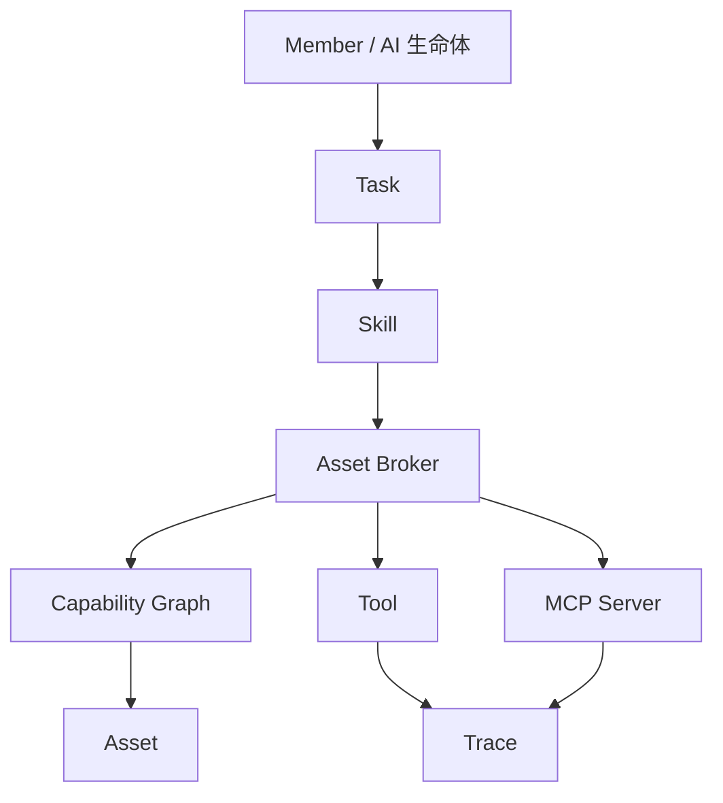

# 资产中心与能力系统设计

## 核心结论

资产中心负责“有什么资源”。Capability Graph 负责“谁能对资源做什么”。Tool/MCP 负责“一次具体动作”。Skill 负责“如何把资源和工具组合成可复用方法”。

不要把这四件事混在一起。

## 概念关系



## 资产分类

资产二级分类固定，不随壳改变。

| 分类 | 说明 | 风险 |
|---|---|---|
| 大脑 | 模型资源和推理 endpoint | 成本、隐私、质量 |
| 账号 | 平台账号、API token、登录信息 | 泄密、越权、外发 |
| 钱包 | 支付账号、链上钱包、资金相关凭证 | 支付、转账、签名 |
| 硬件 | 本地设备、智能家居、外设 | 物理世界影响 |
| 知识库 | 文件、笔记、网页、项目资料 | 隐私、版权、过期 |

## 大脑资产

大脑代表模型能力。

字段：

```text
brain_id
display_name
provider
endpoint
model_name
api_key_ref
is_local
context_window
supports_tools
supports_vision
supports_audio
cost_policy
privacy_policy
status
```

绑定关系：

```text
一个成员可以绑定一个默认大脑
一个成员可以有路由策略
一个任务可以临时请求强模型
系统可以为不同任务选择不同大脑
```

大脑资产不等于成员。成员是人格和记忆，大脑只是推理资源。

## 账号资产

账号代表外部平台身份或 API 凭证。

字段：

```text
asset_id
type = account
platform
display_name
username
secret_ref
auth_type
expires_at
status
bound_skills
allowed_actions
approval_policy
last_verified_at
```

账号必须绑定使用方法：

```text
登录 Skill
发草稿 Skill
发布 Skill
读取数据 Skill
```

示例：

```yaml
asset:
  id: account.xiaohongshu_main
  type: account
  platform: xiaohongshu
  display_name: 小红书主账号
  auth_type: password
  secret_ref: secret://accounts/xhs-main
  bound_skills:
    - xiaohongshu_login
    - xiaohongshu_draft
    - xiaohongshu_publish
  approval:
    publish: required
    profile_edit: denied
```

## 钱包资产

钱包是最高风险资产之一。

首发建议只支持：

```text
查询余额
生成支付草稿
生成转账草稿
打开人工确认页面
```

不建议首发支持：

```text
自动转账
自动签名
自动交易
自动购买
```

钱包字段：

```text
wallet_id
display_name
network
address
credential_ref
allowed_skills
confirmation_level
daily_limit
status
```

钱包动作默认 R6-R7。

## 硬件资产

硬件包括本地设备和智能家居。

字段：

```text
hardware_id
display_name
provider
device_type
location
capabilities
connection_config_ref
status
approval_policy
```

动作分级：

| 动作 | 风险 | 策略 |
|---|---|---|
| 查询状态 | R1 | 自动 |
| 开关灯 | R2 | 可自动 |
| 修改自动化规则 | R4 | 确认 |
| 门锁、安防、摄像头 | R5+ | 强确认 |

## 知识库资产

知识库是长期上下文来源，不是直接塞进 prompt 的文件夹。

字段：

```text
knowledge_base_id
display_name
source_type
root_uri
index_status
embedding_model
last_indexed_at
owner_scope
sensitivity
```

知识库流程：

1. 用户添加文件夹、文档或网页。
2. 系统提取文本和元数据。
3. 生成摘要和向量索引。
4. 保存来源和更新时间。
5. 检索时返回片段、摘要、来源、可信度。

## Asset Broker

Asset Broker 是资源隔离层。

### 输入

```text
subject_id
task_id
asset_query
requested_action
skill_id
context
```

### 输出

```json
{
  "handle_id": "hnd_001",
  "asset_id": "account.xiaohongshu_main",
  "summary": "小红书主账号，可用于生成草稿，发布需要确认",
  "allowed_actions": ["read_profile", "draft_post"],
  "blocked_actions": ["publish_post", "edit_profile"],
  "approval_required": {
    "publish_post": true
  },
  "expires_at": "2026-04-26T12:00:00Z"
}
```

### 禁止

```text
禁止把 secret 明文交给模型
禁止直接返回真实本地敏感路径
禁止绕过 Capability Graph
禁止工具自己读取资产密钥
禁止 MCP 服务默认拥有全部资源
```

## Capability Graph

Capability Graph 负责权限和能力判断。

### 边模型

```text
subject -> capability -> object
```

示例：

```text
member.mobai --draft_post--> account.xiaohongshu_main
department.operations --read--> knowledge.content_strategy
skill.xhs_publish --requires_confirmation--> account.xiaohongshu_main
```

### 决策输入

```text
主体：用户、成员、部门、Skill
对象：资产、知识库、工具、MCP
动作：read/write/execute/manage
上下文：任务、风险、时间、壳、用户偏好
```

### 决策输出

```json
{
  "allowed": true,
  "risk_level": "R4",
  "approval_required": true,
  "reason": "外部平台发布动作需要用户确认",
  "policy_sources": [
    "system.default_external_post",
    "asset.account.xiaohongshu_main"
  ]
}
```

## Skill 设计

Skill 是可复用做事方法。

Skill 可以包含：

```text
说明文档
触发条件
输入 schema
输出 schema
步骤计划
prompt 模板
工具调用声明
MCP 依赖
资产依赖
权限声明
评测用例
版本号
签名
```

### Skill 包结构

```text
bundles/
  browser-research/
    bundle.yaml
    SKILL.md
    prompts/
      plan.md
      summarize.md
    scripts/
      postprocess.py
    mcp/
      servers.yaml
    tests/
      eval_cases.yaml
    signatures/
      bundle.sig
```

### bundle.yaml

```yaml
id: browser-research
version: 0.1.0
display_name: 网页研究技能包
kind: skill_bundle
description: 通过浏览器检索、读取、总结网页内容。
triggers:
  intents:
    - web_research
    - competitor_analysis
permissions:
  net:
    allow_domains:
      - "*"
  browser:
    allow_navigation: true
  fs:
    write:
      - workspace://reports/**
required_mcp:
  - playwright
risk_policy:
  confirmation_required_for:
    - external_post
    - file_delete
evals:
  - tests/eval_cases.yaml
```

### SKILL.md

`SKILL.md` 写给模型和执行器阅读，必须简洁明确：

```text
什么时候使用
输入是什么
输出是什么
步骤是什么
不能做什么
失败如何处理
```

## MCP 设计

MCP 是外部工具协议，不是用户心智层的一等概念。用户可以在系统管理看到 MCP 服务，但普通任务只说“浏览器能力”“家居能力”。

MCP 服务字段：

```text
mcp_server_id
display_name
command
args
env_refs
status
tools
resources
prompts
allowed_members
allowed_skills
risk_policy
```

### MCP 接入流程

1. 用户在系统管理添加 MCP 服务。
2. 系统启动或连接服务。
3. 拉取 tools/resources/prompts。
4. 写入 capability registry。
5. 由 Safety 生成风险默认值。
6. Skill 可声明依赖该 MCP。

## Tool 设计

Tool 是一次具体动作。Tool 必须小而清晰。

示例：

```text
file.read
file.write
file.list
browser.open
browser.snapshot
browser.click
terminal.run
knowledge.search
asset.query
memory.search
```

Tool 调用必须写 trace：

```json
{
  "tool_call_id": "call_001",
  "tool_name": "browser.snapshot",
  "args_redacted": {
    "url": "https://example.com"
  },
  "risk_level": "R1",
  "approved": true,
  "started_at": "...",
  "ended_at": "...",
  "status": "success"
}
```

## 资源感知的最佳方案

最终方案：

```text
智能体默认不知道系统资源
Context Gateway 注入资源摘要
Asset Broker 提供资源查询和句柄
Capability Graph 判断可用性
Skill 描述怎么使用资源
Tool/MCP 执行实际动作
Safety 决定是否确认
Trace 记录全过程
```

错误方案：

```text
把所有资产写进 prompt
让 Skill 自己读数据库找资源
把账号密码放进模型上下文
让 MCP 默认拥有全部权限
让每个智能体都知道所有部门和成员
```

## 资产授权

授权可以给：

```text
成员
部门
角色
Skill
任务
```

示例：

```yaml
grant:
  subject_type: member
  subject_id: member.mobai
  asset_id: account.xiaohongshu_main
  allowed_actions:
    - read_profile
    - draft_post
  denied_actions:
    - edit_profile
  approval_required:
    - publish_post
```

部门继承：

```text
运营部拥有小红书账号草稿权限
墨白属于运营部，默认继承
墨白个人策略可以收紧或扩展
系统安全策略永远最高
```

## 成长机制

系统越用越聪明来自三类沉淀：

| 沉淀 | 来源 | 结果 |
|---|---|---|
| 记忆 | 对话、任务、用户纠错 | 下次更懂用户 |
| Skill | 重复成功任务 | 下次更会做 |
| Capability | 用户授权和资产使用历史 | 下次更清楚什么能用 |

Skill 候选生成条件：

```text
同类任务重复出现
用户明确说“以后都这么做”
任务成功且步骤稳定
失败后修正出稳定流程
某资产使用方法固定
```

## 验收标准

| 模块 | 标准 |
|---|---|
| 资产 | 五类资产可创建、编辑、禁用 |
| 资产句柄 | 模型只能拿到句柄和摘要 |
| 权限 | Capability Graph 能解释 allow/deny |
| Skill | Skill 包可安装、匹配、执行、评测 |
| MCP | MCP 服务能注册工具并受权限控制 |
| Tool | 每次调用有 trace 和风险等级 |
| 高风险 | 外发、支付、删除、系统修改必须确认 |
| 成长 | 成功任务可生成 Skill 候选 |

