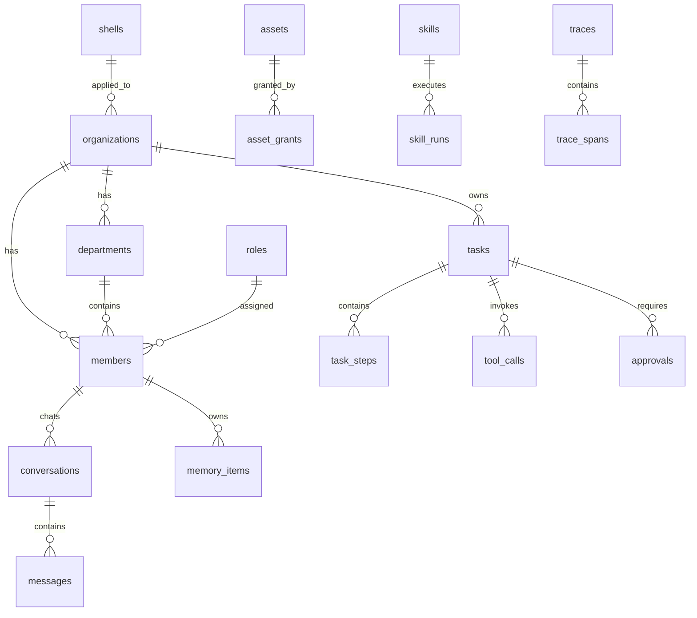

# 数据模型与接口契约

## 设计原则

1. 先写 schema，再写 handler，再写 UI。
2. 底层表不写死公司壳。
3. 所有会影响真实世界的动作必须有 trace。
4. 所有记忆写入必须能回溯来源。
5. 所有资产访问必须通过句柄，不把 secret 放进模型上下文。
6. 所有壳映射都是配置，不自动改业务数据。

## 核心实体关系



## SQL 表结构

以下 SQL 是初版契约，实际 migration 可以按数据库方言做微调。

### shells

```sql
CREATE TABLE shells (
  shell_id TEXT PRIMARY KEY,
  display_name TEXT NOT NULL,
  version TEXT NOT NULL,
  config_json TEXT NOT NULL,
  is_enabled INTEGER NOT NULL DEFAULT 1,
  created_at TEXT NOT NULL,
  updated_at TEXT NOT NULL
);
```

### organizations

```sql
CREATE TABLE organizations (
  organization_id TEXT PRIMARY KEY,
  shell_id TEXT NOT NULL,
  display_name TEXT NOT NULL,
  owner_user_id TEXT NOT NULL,
  owner_title TEXT NOT NULL,
  settings_json TEXT NOT NULL,
  created_at TEXT NOT NULL,
  updated_at TEXT NOT NULL,
  FOREIGN KEY(shell_id) REFERENCES shells(shell_id)
);
```

### departments

```sql
CREATE TABLE departments (
  department_id TEXT PRIMARY KEY,
  organization_id TEXT NOT NULL,
  parent_department_id TEXT,
  key TEXT NOT NULL,
  display_name TEXT NOT NULL,
  description TEXT,
  sort_order INTEGER NOT NULL DEFAULT 0,
  metadata_json TEXT NOT NULL,
  created_at TEXT NOT NULL,
  updated_at TEXT NOT NULL,
  FOREIGN KEY(organization_id) REFERENCES organizations(organization_id)
);

CREATE INDEX idx_departments_org ON departments(organization_id);
```

### roles

```sql
CREATE TABLE roles (
  role_id TEXT PRIMARY KEY,
  organization_id TEXT NOT NULL,
  key TEXT NOT NULL,
  display_name TEXT NOT NULL,
  description TEXT,
  default_department_id TEXT,
  default_skills_json TEXT NOT NULL,
  authority_level INTEGER NOT NULL DEFAULT 0,
  metadata_json TEXT NOT NULL,
  created_at TEXT NOT NULL,
  updated_at TEXT NOT NULL,
  FOREIGN KEY(organization_id) REFERENCES organizations(organization_id)
);
```

### members

```sql
CREATE TABLE members (
  member_id TEXT PRIMARY KEY,
  organization_id TEXT NOT NULL,
  department_id TEXT,
  role_id TEXT,
  display_name TEXT NOT NULL,
  avatar_uri TEXT,
  status TEXT NOT NULL,
  default_brain_id TEXT,
  persona_profile_id TEXT NOT NULL,
  heart_profile_json TEXT NOT NULL,
  memory_policy_json TEXT NOT NULL,
  created_from_shell_id TEXT,
  created_from_template_id TEXT,
  metadata_json TEXT NOT NULL,
  created_at TEXT NOT NULL,
  updated_at TEXT NOT NULL,
  FOREIGN KEY(organization_id) REFERENCES organizations(organization_id),
  FOREIGN KEY(department_id) REFERENCES departments(department_id),
  FOREIGN KEY(role_id) REFERENCES roles(role_id)
);

CREATE INDEX idx_members_org ON members(organization_id);
CREATE INDEX idx_members_department ON members(department_id);
```

### brains

```sql
CREATE TABLE brains (
  brain_id TEXT PRIMARY KEY,
  display_name TEXT NOT NULL,
  provider TEXT NOT NULL,
  endpoint TEXT,
  model_name TEXT NOT NULL,
  api_key_ref TEXT,
  is_local INTEGER NOT NULL DEFAULT 0,
  context_window INTEGER,
  supports_tools INTEGER NOT NULL DEFAULT 0,
  supports_vision INTEGER NOT NULL DEFAULT 0,
  supports_audio INTEGER NOT NULL DEFAULT 0,
  cost_policy_json TEXT NOT NULL,
  privacy_policy_json TEXT NOT NULL,
  status TEXT NOT NULL,
  created_at TEXT NOT NULL,
  updated_at TEXT NOT NULL
);
```

### assets

```sql
CREATE TABLE assets (
  asset_id TEXT PRIMARY KEY,
  organization_id TEXT NOT NULL,
  asset_type TEXT NOT NULL,
  display_name TEXT NOT NULL,
  provider TEXT,
  status TEXT NOT NULL,
  sensitivity TEXT NOT NULL,
  config_json TEXT NOT NULL,
  secret_ref TEXT,
  expires_at TEXT,
  last_verified_at TEXT,
  created_at TEXT NOT NULL,
  updated_at TEXT NOT NULL,
  FOREIGN KEY(organization_id) REFERENCES organizations(organization_id)
);

CREATE INDEX idx_assets_org_type ON assets(organization_id, asset_type);
```

asset_type 固定：

```text
brain
account
wallet
hardware
knowledge_base
```

### asset_grants

```sql
CREATE TABLE asset_grants (
  grant_id TEXT PRIMARY KEY,
  organization_id TEXT NOT NULL,
  subject_type TEXT NOT NULL,
  subject_id TEXT NOT NULL,
  asset_id TEXT NOT NULL,
  allowed_actions_json TEXT NOT NULL,
  denied_actions_json TEXT NOT NULL,
  approval_policy_json TEXT NOT NULL,
  valid_from TEXT,
  valid_to TEXT,
  created_at TEXT NOT NULL,
  updated_at TEXT NOT NULL,
  FOREIGN KEY(asset_id) REFERENCES assets(asset_id)
);

CREATE INDEX idx_asset_grants_subject ON asset_grants(subject_type, subject_id);
CREATE INDEX idx_asset_grants_asset ON asset_grants(asset_id);
```

### skills

```sql
CREATE TABLE skills (
  skill_id TEXT PRIMARY KEY,
  bundle_id TEXT NOT NULL,
  version TEXT NOT NULL,
  display_name TEXT NOT NULL,
  description TEXT,
  manifest_json TEXT NOT NULL,
  status TEXT NOT NULL,
  installed_at TEXT NOT NULL,
  updated_at TEXT NOT NULL
);
```

### skill_runs

```sql
CREATE TABLE skill_runs (
  skill_run_id TEXT PRIMARY KEY,
  skill_id TEXT NOT NULL,
  task_id TEXT,
  member_id TEXT NOT NULL,
  input_json TEXT NOT NULL,
  output_json TEXT,
  status TEXT NOT NULL,
  started_at TEXT NOT NULL,
  ended_at TEXT,
  FOREIGN KEY(skill_id) REFERENCES skills(skill_id)
);
```

### conversations

```sql
CREATE TABLE conversations (
  conversation_id TEXT PRIMARY KEY,
  organization_id TEXT NOT NULL,
  title TEXT,
  conversation_type TEXT NOT NULL,
  primary_member_id TEXT,
  participant_json TEXT NOT NULL,
  status TEXT NOT NULL,
  created_at TEXT NOT NULL,
  updated_at TEXT NOT NULL
);
```

conversation_type：

```text
single
department_group
organization_meeting
system
```

### messages

```sql
CREATE TABLE messages (
  message_id TEXT PRIMARY KEY,
  conversation_id TEXT NOT NULL,
  turn_id TEXT,
  author_type TEXT NOT NULL,
  author_id TEXT,
  content_type TEXT NOT NULL,
  content_text TEXT,
  content_json TEXT NOT NULL,
  trace_id TEXT,
  created_at TEXT NOT NULL,
  FOREIGN KEY(conversation_id) REFERENCES conversations(conversation_id)
);

CREATE INDEX idx_messages_conversation_time ON messages(conversation_id, created_at);
CREATE VIRTUAL TABLE messages_fts USING fts5(content_text, message_id UNINDEXED);
```

### memory_items

```sql
CREATE TABLE memory_items (
  memory_id TEXT PRIMARY KEY,
  organization_id TEXT NOT NULL,
  member_id TEXT,
  user_id TEXT NOT NULL,
  layer TEXT NOT NULL,
  kind TEXT NOT NULL,
  payload_json TEXT NOT NULL,
  source_json TEXT NOT NULL,
  confidence REAL NOT NULL,
  sensitivity TEXT NOT NULL,
  valid_from TEXT,
  valid_to TEXT,
  supersedes TEXT,
  status TEXT NOT NULL,
  created_at TEXT NOT NULL,
  updated_at TEXT NOT NULL
);

CREATE INDEX idx_memory_member_layer ON memory_items(member_id, layer);
CREATE INDEX idx_memory_kind ON memory_items(kind);
```

### tasks

```sql
CREATE TABLE tasks (
  task_id TEXT PRIMARY KEY,
  organization_id TEXT NOT NULL,
  conversation_id TEXT,
  created_by_user_id TEXT NOT NULL,
  owner_member_id TEXT,
  assigned_department_id TEXT,
  title TEXT NOT NULL,
  goal TEXT NOT NULL,
  mode TEXT NOT NULL,
  status TEXT NOT NULL,
  priority TEXT NOT NULL,
  risk_level TEXT NOT NULL,
  success_criteria_json TEXT NOT NULL,
  plan_json TEXT NOT NULL,
  result_json TEXT,
  started_at TEXT,
  ended_at TEXT,
  created_at TEXT NOT NULL,
  updated_at TEXT NOT NULL
);

CREATE INDEX idx_tasks_org_status ON tasks(organization_id, status);
CREATE INDEX idx_tasks_owner ON tasks(owner_member_id);
```

### task_steps

```sql
CREATE TABLE task_steps (
  step_id TEXT PRIMARY KEY,
  task_id TEXT NOT NULL,
  parent_step_id TEXT,
  owner_member_id TEXT,
  step_type TEXT NOT NULL,
  title TEXT NOT NULL,
  input_json TEXT NOT NULL,
  output_json TEXT,
  status TEXT NOT NULL,
  sort_order INTEGER NOT NULL,
  started_at TEXT,
  ended_at TEXT,
  FOREIGN KEY(task_id) REFERENCES tasks(task_id)
);
```

### approvals

```sql
CREATE TABLE approvals (
  approval_id TEXT PRIMARY KEY,
  task_id TEXT,
  tool_call_id TEXT,
  requested_action TEXT NOT NULL,
  risk_level TEXT NOT NULL,
  summary TEXT NOT NULL,
  payload_json TEXT NOT NULL,
  status TEXT NOT NULL,
  decided_by_user_id TEXT,
  decided_at TEXT,
  created_at TEXT NOT NULL
);
```

### tool_calls

```sql
CREATE TABLE tool_calls (
  tool_call_id TEXT PRIMARY KEY,
  task_id TEXT,
  step_id TEXT,
  member_id TEXT,
  tool_name TEXT NOT NULL,
  args_json TEXT NOT NULL,
  args_redacted_json TEXT NOT NULL,
  result_json TEXT,
  risk_level TEXT NOT NULL,
  approval_id TEXT,
  status TEXT NOT NULL,
  started_at TEXT NOT NULL,
  ended_at TEXT
);
```

### traces 与 trace_spans

```sql
CREATE TABLE traces (
  trace_id TEXT PRIMARY KEY,
  conversation_id TEXT,
  turn_id TEXT,
  task_id TEXT,
  root_span_id TEXT,
  status TEXT NOT NULL,
  started_at TEXT NOT NULL,
  ended_at TEXT
);

CREATE TABLE trace_spans (
  span_id TEXT PRIMARY KEY,
  trace_id TEXT NOT NULL,
  parent_span_id TEXT,
  span_type TEXT NOT NULL,
  name TEXT NOT NULL,
  input_json TEXT,
  output_json TEXT,
  metadata_json TEXT NOT NULL,
  started_at TEXT NOT NULL,
  ended_at TEXT,
  status TEXT NOT NULL,
  FOREIGN KEY(trace_id) REFERENCES traces(trace_id)
);
```

## JSON 契约

### ChatTurnRequest

```json
{
  "session_id": "ses_001",
  "conversation_id": "conv_001",
  "member_id": "mem_xiaoyao",
  "input": {
    "type": "text",
    "text": "帮我做一个产品方案"
  },
  "attachments": [],
  "client_context": {
    "timezone": "Asia/Shanghai",
    "locale": "zh-CN"
  }
}
```

### ChatTurnResponse

```json
{
  "turn_id": "turn_001",
  "conversation_id": "conv_001",
  "message_id": "msg_001",
  "task_id": "tsk_001",
  "trace_id": "trc_001",
  "status": "completed"
}
```

### MemoryItem

```json
{
  "memory_id": "mem_001",
  "layer": "semantic",
  "kind": "preference",
  "payload": {
    "fact": "用户喜欢结论先行、结构化、详细的产品设计文档"
  },
  "source": {
    "type": "conversation",
    "conversation_id": "conv_001",
    "turn_id": "turn_001"
  },
  "confidence": 0.9,
  "sensitivity": "low",
  "valid_from": "2026-04-26T00:00:00+08:00",
  "valid_to": null,
  "supersedes": null
}
```

### AssetHandle

```json
{
  "handle_id": "hnd_001",
  "asset_id": "account.xiaohongshu_main",
  "asset_type": "account",
  "summary": "小红书主账号，可生成草稿，发布需要确认",
  "allowed_actions": ["read_profile", "draft_post"],
  "approval_required_actions": ["publish_post"],
  "expires_at": "2026-04-26T12:00:00+08:00"
}
```

### TaskPlan

```json
{
  "task_id": "tsk_001",
  "mode": "workflow",
  "goal": "整理下载文件夹并生成报告",
  "success_criteria": [
    "扫描文件完成",
    "重复文件识别完成",
    "生成归档建议",
    "不自动删除文件"
  ],
  "steps": [
    {"id": "s1", "type": "tool", "tool": "file.list"},
    {"id": "s2", "type": "skill", "skill": "file_classify"},
    {"id": "s3", "type": "approval", "required_for": ["file_move", "file_delete"]},
    {"id": "s4", "type": "compose", "output": "markdown_report"}
  ],
  "risk_level": "R3"
}
```

## API 清单

### Chat

| 方法 | 路径 | 说明 |
|---|---|---|
| POST | `/api/chat/turn` | 发起一轮聊天 |
| GET | `/api/chat/stream/{turn_id}` | 获取事件流 |
| POST | `/api/chat/conversations` | 创建会话 |
| GET | `/api/chat/conversations` | 会话列表 |
| GET | `/api/chat/conversations/{id}` | 会话详情 |

### Members

| 方法 | 路径 | 说明 |
|---|---|---|
| POST | `/api/members` | 创建成员 |
| GET | `/api/members` | 成员列表 |
| GET | `/api/members/{id}` | 成员详情 |
| PATCH | `/api/members/{id}` | 更新成员 |
| POST | `/api/members/{id}/clone` | 克隆成员 |
| POST | `/api/members/{id}/archive` | 归档成员 |

### Organization

| 方法 | 路径 | 说明 |
|---|---|---|
| GET | `/api/organization/current` | 当前组织 |
| PATCH | `/api/organization/current` | 更新组织 |
| POST | `/api/departments` | 创建部门 |
| GET | `/api/departments` | 部门列表 |
| PATCH | `/api/departments/{id}` | 更新部门 |
| POST | `/api/roles` | 创建角色 |
| GET | `/api/roles` | 角色列表 |

### Assets

| 方法 | 路径 | 说明 |
|---|---|---|
| POST | `/api/assets` | 创建资产 |
| GET | `/api/assets` | 资产列表 |
| GET | `/api/assets/{id}` | 资产详情 |
| PATCH | `/api/assets/{id}` | 更新资产 |
| POST | `/api/assets/{id}/verify` | 验证资产可用性 |
| POST | `/api/assets/query` | 查询资源句柄 |
| POST | `/api/assets/grants` | 创建授权 |

### Tasks

| 方法 | 路径 | 说明 |
|---|---|---|
| POST | `/api/tasks` | 创建任务 |
| GET | `/api/tasks` | 任务列表 |
| GET | `/api/tasks/{id}` | 任务详情 |
| POST | `/api/tasks/{id}/pause` | 暂停任务 |
| POST | `/api/tasks/{id}/resume` | 恢复任务 |
| POST | `/api/tasks/{id}/cancel` | 取消任务 |
| GET | `/api/tasks/{id}/replay` | 任务回放 |

### Approvals

| 方法 | 路径 | 说明 |
|---|---|---|
| POST | `/api/approvals/{id}/approve` | 同意动作 |
| POST | `/api/approvals/{id}/deny` | 拒绝动作 |
| POST | `/api/approvals/{id}/edit` | 修改后继续 |

### Memory

| 方法 | 路径 | 说明 |
|---|---|---|
| POST | `/api/memory/search` | 检索记忆 |
| GET | `/api/memory` | 记忆列表 |
| PATCH | `/api/memory/{id}` | 修正记忆 |
| POST | `/api/memory/{id}/archive` | 归档记忆 |
| POST | `/api/memory/extract` | 手动触发记忆抽取 |

### Skills 与 MCP

| 方法 | 路径 | 说明 |
|---|---|---|
| POST | `/api/skills/install` | 安装 Skill 包 |
| GET | `/api/skills` | Skill 列表 |
| PATCH | `/api/skills/{id}` | 启停 Skill |
| POST | `/api/skills/{id}/eval` | 运行 Skill 评测 |
| POST | `/api/mcp/servers` | 添加 MCP 服务 |
| GET | `/api/mcp/servers` | MCP 服务列表 |
| POST | `/api/mcp/servers/{id}/restart` | 重启 MCP 服务 |

### Settings

| 方法 | 路径 | 说明 |
|---|---|---|
| GET | `/api/settings` | 获取设置 |
| PATCH | `/api/settings` | 更新设置 |
| GET | `/api/shells` | 壳列表 |
| POST | `/api/shells/switch` | 切换壳 |
| GET | `/api/traces/{id}` | 获取 trace |
| GET | `/api/audit` | 审计日志 |

## 事件流

事件格式：

```json
{
  "event": "response.delta",
  "turn_id": "turn_001",
  "timestamp": "2026-04-26T10:00:00+08:00",
  "payload": {}
}
```

事件类型：

```text
turn.started
context.started
context.ready
model.started
model.completed
task.created
task.step_started
task.step_completed
tool.started
tool.completed
approval.required
approval.resolved
response.delta
response.completed
memory.candidate
memory.written
turn.completed
turn.failed
```

## 索引建议

必须有索引：

```text
messages(conversation_id, created_at)
memory_items(member_id, layer)
memory_items(kind)
tasks(organization_id, status)
tool_calls(task_id)
trace_spans(trace_id)
asset_grants(subject_type, subject_id)
assets(organization_id, asset_type)
```

全文检索：

```text
messages_fts
memory_fts
knowledge_chunks_fts
```

向量集合：

```text
memory_episodic
memory_semantic
knowledge_chunks
skill_examples
asset_summaries
```

## Migration 原则

```text
所有表必须有 created_at
可变结构放 json，但关键查询字段必须列化
删除优先软删除或归档
敏感值只存 secret_ref
所有 schema 改动配 migration 和回滚说明
测试库必须能从零创建
```

