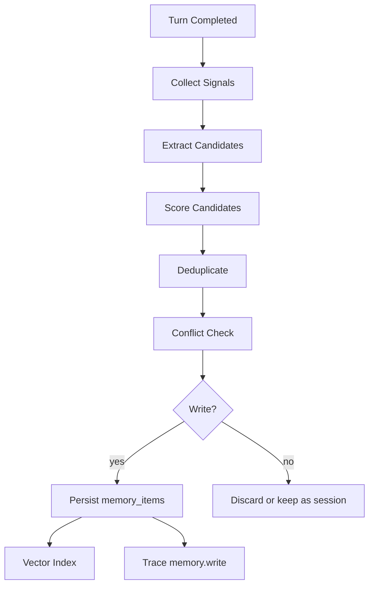

# 记忆系统详细设计

## 记忆目标

记忆系统是产品长期粘性的核心。它要让智能体越用越懂用户，但不能把所有历史粗暴塞进上下文。

目标：

```text
记住用户稳定偏好
记住项目事实
记住任务经历
记住成员关系和人格连续性
记住可复用做事流程
允许用户查看、修改、删除或归档
处理时间变化和冲突
每条记忆可追溯来源
```

## 记忆分层

| 层 | 名称 | 存储 | 作用 |
|---|---|---|---|
| L0 | Working Memory | 进程内 | 当前 turn 临时变量和工具结果 |
| L1 | Session Memory | SQLite | 当前会话摘要和短线任务状态 |
| L2 | Episodic Memory | SQLite + 向量 | 发生过的事件、对话片段、任务经历 |
| L3 | Semantic Memory | SQLite + 向量 | 用户稳定偏好、长期事实、项目背景 |
| L4 | Procedural Memory | Skill registry + SQLite | 可复用流程、成功经验、Skill 候选 |
| L5 | Asset Memory | SQLite + 向量 | 资产摘要、知识库索引、资源使用历史 |
| L6 | Temporal Relation Memory | SQLite，后续图谱 | 事实随时间变化的版本关系 |

## 记忆作用域

```text
user_scope：用户级记忆
organization_scope：组织级记忆
member_scope：成员私有记忆
conversation_scope：会话记忆
task_scope：任务临时记忆
asset_scope：资产相关记忆
```

默认规则：

```text
成员私有记忆不自动共享给其他成员
组织级事实可以被授权成员检索
资产记忆只通过 Asset Broker 摘要进入上下文
任务临时记忆任务结束后再决定是否沉淀
```

## 写入流程



## 记忆候选类型

| 类型 | 示例 | 默认层 |
|---|---|---|
| preference | 用户喜欢结论先行 | L3 |
| project_fact | 项目首发只做公司壳 | L3 |
| episodic_event | 用户今天让系统整理设计文档 | L2 |
| relationship_signal | 用户希望回复更温暖 | L3 |
| correction | 用户纠正“岗位显示身份但值不变” | L6 |
| skill_candidate | 以后产品设计都按这个模板输出 | L4 |
| asset_usage | 墨白常用小红书主账号写草稿 | L5 |

## 评分规则

候选记忆评分：

```text
score = value * stability * confidence * user_signal - sensitivity_penalty - duplicate_penalty
```

维度：

| 维度 | 说明 |
|---|---|
| value | 对未来帮助程度 |
| stability | 是否长期稳定 |
| confidence | 模型抽取是否可靠 |
| user_signal | 用户是否明确表达“记住” |
| sensitivity | 是否涉及隐私或秘密 |
| duplicate | 是否已存在相同记忆 |

写入阈值：

| 类型 | 阈值 |
|---|---:|
| 用户明确要求记住 | 0.55 |
| 偏好 | 0.70 |
| 项目事实 | 0.75 |
| 关系信号 | 0.80 |
| 敏感信息 | 默认不写，除非用户明确授权 |

## 不该写入长期记忆的内容

```text
一次性闲聊细节
低置信猜测
临时情绪，除非用户明确表达
密钥、密码、私钥、助记词
未经确认的网页内容
工具错误堆栈的完整敏感路径
可能造成用户负担的过度画像
```

## 冲突处理

不要覆盖旧记忆，要保留时间关系。

示例：

旧记忆：

```json
{
  "memory_id": "mem_old",
  "kind": "preference",
  "payload": {"fact": "用户喜欢咖啡"},
  "valid_from": "2026-04-01",
  "valid_to": null
}
```

新记忆：

```json
{
  "memory_id": "mem_new",
  "kind": "preference",
  "payload": {"fact": "用户现在改喝茶"},
  "valid_from": "2026-04-26",
  "supersedes": "mem_old"
}
```

旧记忆更新：

```text
valid_to = 2026-04-26
status = superseded
```

## 检索流程

检索顺序：

1. 成员 pinned persona。
2. 当前会话摘要。
3. 用户稳定偏好。
4. 当前项目事实。
5. 相关历史任务。
6. 可复用 Skill 记忆。
7. 资产摘要。

检索输入：

```json
{
  "query": "帮我继续设计这个项目",
  "member_id": "mem_xiaoyao",
  "organization_id": "org_001",
  "conversation_id": "conv_001",
  "intent": "product_design",
  "limit": 12
}
```

检索输出：

```json
{
  "items": [
    {
      "memory_id": "mem_001",
      "layer": "semantic",
      "kind": "project_fact",
      "summary": "项目首发公司壳，底层壳系统可扩展",
      "score": 0.93,
      "source": {"conversation_id": "conv_001"}
    }
  ]
}
```

## Context Gateway 中的记忆压缩

进入模型上下文的不是完整 memory item，而是压缩后的 memory block：

```text
用户偏好：
- 用户希望文档非常详细，能直接给 AI 编程工具还原开发。
- 用户要求严格沿用之前设计，不推翻核心规则。

项目事实：
- 聊天页不显示组织和壳。
- 公司壳首发，底层不写死公司。
- 智能体默认独立，资源通过工具/MCP/Skill 感知。
```

## 记忆可视化

记忆页面分四个视图：

```text
事实卡片
时间线
来源视图
冲突和覆盖
```

每条记忆显示：

```text
内容
类型
作用域
置信度
敏感等级
来源
创建时间
生效时间
是否被替代
操作：编辑、归档、删除、降低权重
```

## 用户纠错

用户可以说：

```text
这条记忆不对
以后不要记这个
把我的偏好改成详细但先给结论
```

系统行为：

```text
找到相关记忆
生成 correction
更新 status 或 supersede
写入 trace
下次检索避免旧记忆
```

## 记忆和 Skill 的关系

记忆记录经验，Skill 固化流程。

当出现以下情况，Memory 生成 Skill 候选：

```text
用户说“以后都按这个流程”
同类任务多次成功
同一资产的使用方法固定
同一格式反复被用户喜欢
失败后用户修正形成稳定流程
```

Skill 候选不自动启用，先进入系统管理的 Skill 候选区。

## 记忆评测

评测维度：

| 维度 | 用例 |
|---|---|
| 抽取 | 能否从聊天中提取真实偏好 |
| 召回 | 下次相关场景能否召回 |
| 更新 | 新事实能否 supersede 旧事实 |
| 拒答 | 不相关时不要乱召回 |
| 隐私 | 不写入 secret |
| 来源 | 每条记忆有 source |

最小测试：

```text
用户说“以后文档要非常详细” -> 写入偏好
用户说“不是员工，是成员” -> 修正术语记忆
用户改偏好 -> supersede 旧记忆
网页内容带指令 -> 不写成用户偏好
任务完成 -> 写入 episodic memory
```

## 实现文件

```text
services/memory/models.py
services/memory/extractor.py
services/memory/scorer.py
services/memory/conflict.py
services/memory/retriever.py
services/memory/compressor.py
services/memory/vector_index.py
services/memory/correction.py
services/memory/evals.py
apps/local-api/app/api/routes_memory.py
apps/local-api/app/db/repositories/memory_repo.py
```

