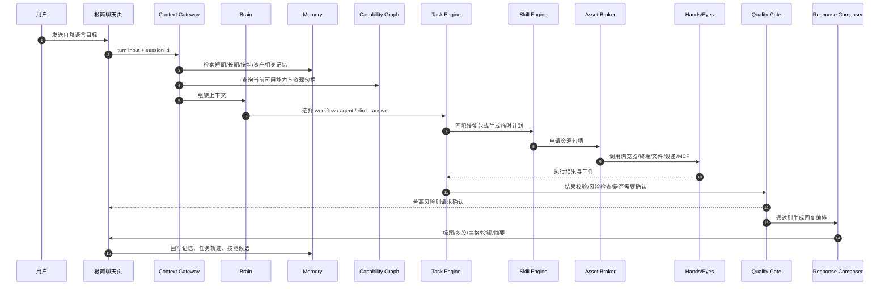
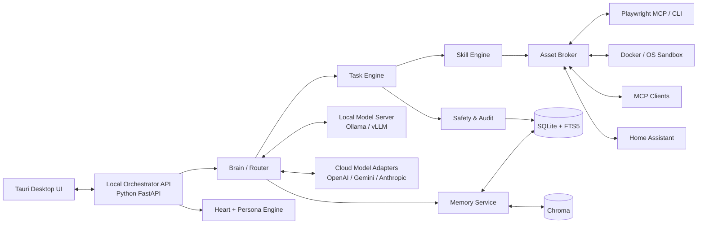
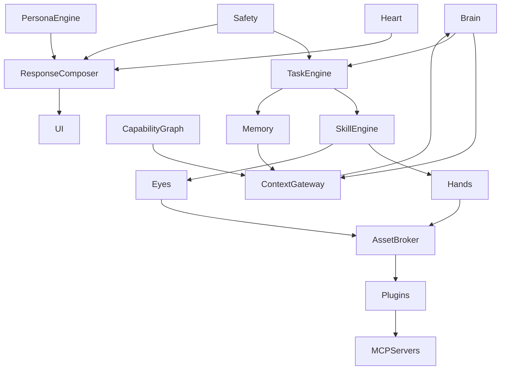

# 可单机部署的个人智能体操作系统最终方案

## 执行摘要

这份方案的核心结论是：不要把产品做成“聊天壳 + 一堆工具按钮”的轻型助手，也不要一开始就做成“多智能体公司操作系统”的重平台，而是做成一个**单用户、单机优先、聊天优先、长期可成长**的个人智能体操作系统。它要同时吸收 OpenClaw 的“自托管网关、到处可聊”和 Hermes Agent 的“自我改进、技能沉淀、跨会话记忆”两类优点，但在实现上比两者都更克制：**前台只有极简聊天体验，后台才是 Brain / Heart / Memory / Hands / Eyes / Skills / Plugins / Task / Safety 的分层系统**。OpenClaw 把自己定义为“self-hosted gateway”，一条 Gateway 进程连接多聊天入口；Hermes Agent 则强调“从经验中创建技能、在使用中改进技能、搜索过去会话进行召回”，并以持久化的用户/工作模型作为长期价值核心。它们说明了两个方向都成立，但也提示了一个事实：**真正长期有粘性的产品，不是单轮问答质量，而是‘记忆 + 行动力 + 持续变聪明’的复合能力**。citeturn33view0turn33view1turn33view3

从研究与工程实践看，这个产品最稳妥的底层范式不是“纯工作流”也不是“纯自循环 agent”，而是**工作流与 agent 混合**。ReAct 证明了“推理轨迹 + 行动”交错生成能提升任务完成与可解释性；Generative Agents 证明了“经验记录—反思—动态检索”能显著提升拟人感；MemGPT 提出了类似操作系统的分层记忆；Voyager 证明“可执行技能库”会让系统能力复利增长；LongMemEval 与 AgentBench 则分别说明长期记忆和真实交互任务都必须单独评测，而不能只看通用聊天分数。citeturn28view2turn28view3turn28view0turn28view1turn25view15turn28view4

因此，本方案的产品定义是：

> **个人智能体操作系统**：一个以聊天为唯一主入口、以本地单机为默认部署方式、以长期记忆与任务执行为核心竞争力、以壳层世界观做语义映射、以技能包和 MCP 做能力扩展、以审计与安全边界保证可控性的智能体平台。

这套方案的最终取舍是：

| 设计面 | 最终选择 | 原因 |
|---|---|---|
| 主入口 | 聊天 | 用户学习成本最低，统一问答、创作、执行、回放 |
| 部署 | 单机优先，本地优先，可混合云 | 满足家用机、隐私、低门槛 |
| Orchestration | Workflow + Agent 混合 | 兼顾稳定性与开放性 |
| 记忆 | 分层记忆 + 时间有效性 + 可视化面板 | 既能长期记住，又不把上下文塞爆 |
| 能力扩展 | 统一“技能包”概念，底层兼容 skill / plugin / MCP | 用户心智简单，工程上可插拔 |
| 交互风格 | 拟人但不失控，温暖但不越界 | 保留情绪价值，同时避免伪装和操控风险 |
| 安全策略 | 默认舒适，不做复杂权限向导；高风险动作始终确认 | 兼顾上手体验与真实可控 |

如果只保留一句落地建议，那就是：**先做一台“会聊天、会记、会做事、会成长”的单人智能体电脑，而不是一座“概念很大、却很难真正好用”的智能体城市。**

## 产品定位与核心体验

### 产品定位

面向对象是**个人家用电脑用户**，云供应商**未指定**。默认产品形态是本地桌面应用，核心目标不是替代搜索、也不是替代 IDE，而是成为用户的**长期数字生命体**：既能像员工一样执行任务，也能像朋友一样持续陪伴，还能像管家一样管理信息、资产和待办。citeturn33view1turn33view2

产品要解决的不是“能不能回答问题”，而是以下四件事能否同时成立：

1. **聊天质量高**：不是机械一问一答，而是能根据上下文自动组织标题、重点、表格、多段回复、按钮动作、下一步建议。
2. **长期记住你**：记住你的偏好、习惯、项目、关系、设备、资产、反复做的事，以及这些信息何时改变。
3. **真的能做事**：能调用本地文件、浏览器、终端、家庭设备、知识库、插件与 MCP 服务，把目标转成结果。
4. **越用越聪明**：把重复动作沉淀成技能包，把成功路径变成可复用流程，把失败经验变成后续规避规则。citeturn28view1turn33view1turn30view7turn31view1

### 用户画像与场景

| 用户画像 | 典型诉求 | 代表场景 |
|---|---|---|
| 重度个人效率用户 | 一句话安排复杂任务 | “把今天要办的事整理成行动清单，顺手把资料归档” |
| 内容/知识工作者 | 持续记住项目上下文 | “延续上周那份方案，按我一贯风格继续写” |
| 伴侣/陪伴型用户 | 长期关系感与情绪价值 | “记得我的口味、节奏、话题禁忌和开心点” |
| 家庭设备用户 | 管理本地资源与智能家居 | “看看客厅灯是不是还开着，顺手关掉” |
| 轻开发/自动化用户 | 把常做动作做成技能 | “以后‘整理下载文件夹’都按这个套路做” |

如果以后扩展壳层，本系统允许把**同一套底层数据与能力**映射为不同世界观，例如“公司壳”“宗门壳”“朝廷壳”；但在 **MVP 阶段只做公司壳**，其他壳**未指定**。更重要的是，**壳只改变展示语义和模板，不改变底层真实数据结构**：例如一个成员的真实字段仍是 `role=技术经理`，换到宗门壳后 UI 可显示为“身份：技术经理”，只有用户主动更新成“炼器长老”时，底层数据才会改变。这能避免“换壳即重写数据”的系统性混乱。

### 核心体验原则

第一原则是**聊天页极简**。聊天页只显示**人名、头像、状态、输入框、关键动作按钮**，不展示组织架构，不展示壳层世界观，也不把“部门”“组织”“资产归属”等抽象系统信息塞进主对话区。用户在聊天里感受到的是“我在和这个生命体说话”，而不是“我在操作一个后台系统”。

第二原则是**创建智能体极简**。默认创建流程只配置三件事：  
**大脑**（模型与路由策略）、**性格**（人格/语气模板）、**名字与头像**。  
不要求用户在开始阶段配置复杂权限和资产边界。为了兼顾安全与舒适，系统不做冗长权限向导，而是采用“**舒适默认 + 高风险确认**”：常见个人能力包默认可用，但涉及购买、转账、删除、大规模外发、系统设置修改、敏感文件出站时一律走确认与审计，这与 entity["organization","OWASP","appsec nonprofit"] 和 entity["organization","NIST","us standards agency"] 的 agent 安全实践一致，也符合 entity["company","OpenAI","ai company"] 对 computer use 的隔离、允许列表与人工确认要求。citeturn25view12turn29view0turn29view1turn32view1turn32view2

### 主链路逻辑

下面是最重要的一条用户主链路：用户只发一句话，系统自己完成上下文构建、记忆召回、能力选择、任务执行、结果编排和记忆回写。



这个链路的关键不是“模型多强”，而是**Context Gateway、Memory、Capability Graph、Task Engine、Response Composer** 这几个中间层是否设计正确。ReAct、LangGraph、OpenAI Agents、Gemini Agents、Hermes 的共同经验都说明：真正的 agent 质量，取决于**上下文管理、工具边界、状态持续化和回放能力**，不取决于单次 prompt 写得多花。citeturn28view2turn25view7turn31view2turn26view11turn33view1

## 功能地图与交互设计

### 信息架构

在 **公司壳 MVP** 下，一级菜单建议固定为下表。后续换壳时，除了“系统管理”及其二级菜单固定不变以外，其余菜单可按壳做语义映射；“资产管理”一级菜单名称可变，但其二级结构尽量保持稳定。

| 一级菜单 | 聊天页是否显示 | 是否可被壳改名 | 说明 |
|---|---:|---:|---|
| 聊天 | 是 | 否 | 唯一主入口，永远极简 |
| 成员管理 | 否 | 是 | 公司壳是员工，其他壳映射为弟子/官员等 |
| 组织管理 | 否 | 是 | 公司壳是部门/汇报关系 |
| 资产管理 | 否 | 是 | 一级可改名，二级尽量稳定 |
| 任务管理 | 否 | 是 | 任务、计划、工单、自动化、回放 |
| 系统管理 | 否 | 否 | 固定名称、固定结构、固定排版 |

### 完整功能清单

下面按优先级给出完整功能地图。这里的“完整”不是把所有想法都塞进首发，而是明确哪些进入 MVP，哪些作为中期增强，哪些是平台化能力。

| 模块 | P0 | P1 | P2 |
|---|---|---|---|
| 聊天 | 多段回复、表格、重点高亮、操作按钮、流式输出、历史会话 | 语音输入/输出、富文本卡片、草稿续写 | 实时语音陪伴、视频表情反馈 |
| Brain | 意图识别、模型路由、回答/执行分流 | 多智能体协作、计划优化 | 自主长期目标管理 |
| Heart | 情绪识别、语气调节、关系连续性 | 情绪修复策略、陪伴模式 | 长期关系阶段建模 |
| Persona Engine | 人格模板、模式切换、世界观映射 | 多 persona 组合 | 动态人格演化 |
| Memory | 短期/会话/长期/技能记忆、记忆面板 | 时间冲突管理、记忆评星、记忆纠错 | 关系图谱、反事实记忆模拟 |
| Hands | 文件、终端、浏览器、剪贴板 | 批处理、导出、外设联动 | 桌面 GUI 自动化 |
| Eyes | 页面快照、OCR 辅助、文件内容理解 | 本地截图视觉理解 | 持续屏幕观察 |
| Skills | 技能包安装、启停、版本管理 | 技能评测、技能市场 | 自动技能蒸馏 |
| Plugins | 统一插件目录、鉴权、签名校验 | 插件推荐、灰度启用 | 社区市场与信誉系统 |
| Asset Broker | 文件、笔记、联系人、资料库、设备句柄 | 数据源同步、知识资产索引 | 跨应用资产图 |
| Task | 计划、执行、暂停、恢复、回放、审计 | 定时任务、条件触发 | 半自主后台代理 |
| Safety | 风险分级、人工确认、沙箱、出站控制 | prompt injection 检测、DLP | 自适应风险策略 |
| 系统管理 | 模型、技能包、MCP、壳层、日志、备份 | 多配置档案、导入导出 | 多设备同步 |

### 聊天质量保障

聊天是产品表面，也是产品口碑的第一触点，所以必须单独设计，而不是把模型原始输出直接展示出来。

#### 回复编排

Response Composer 不直接显示模型“裸回答”，而是输出一个结构化回复计划，例如：

- 是否需要标题
- 是否需要摘要
- 是否适合使用表格
- 是否适合拆成多段
- 是否需要显示下一步操作按钮
- 是否需要加入温度化语句、幽默、安慰或提醒
- 是否需要附带“我已经帮你做了什么 / 还需要你确认什么”

这会显著改善“只是会答”和“真的好用”的体感差异。

#### 情绪与人格

Heart 负责识别用户当下处于哪种状态：赶时间、迷茫、开心、焦虑、求安慰、求执行、求决策、求玩笑。Persona Engine 决定它用什么角色回应：靠谱员工、熟悉朋友、轻陪伴对象、严谨助理。  
但这里必须加边界：系统可以拟人、可以温暖、可以幽默，甚至可提供陪伴型体验；**但不能在高影响事务中故意用情感放大用户依赖感，也不能掩盖自己是 AI 的事实**。NIST 明确把 human-AI configuration、拟人化界面和内容真实性作为需要治理的风险点，并建议持续跟踪用户感知与人机配置效果。citeturn29view3turn29view2

#### 极简聊天页实现规则

聊天页只保留以下元素：

| 元素 | 保留 | 说明 |
|---|---:|---|
| 头像 | 是 | 允许建立关系感 |
| 人名 | 是 | 统一人格识别入口 |
| 在线/忙碌状态 | 是 | 让执行行为有存在感 |
| 顶部组织/壳信息 | 否 | 避免系统感压过生命感 |
| 部门、组织树 | 否 | 聊天页不出现 |
| 资产归属标签 | 否 | 放到详情页或任务回放里 |
| 回复样式切换 | 是 | 用户可选“简洁 / 标准 / 详细 / 陪伴” |
| 快捷动作按钮 | 是 | 如“继续做”“生成计划”“回看过程”“确认执行” |

## 技术架构与模块实现

### 单机本地部署架构

本方案建议采用 **桌面壳 + 本地后端 + 可选本地模型服务 + 可选云模型适配器** 的结构。推荐实现组合是：

- 桌面端：Tauri + React
- 本地 Orchestrator：Python + FastAPI + Pydantic
- 主数据：SQLite
- 语义检索：Chroma PersistentClient
- 本地模型适配：Ollama / vLLM（OpenAI-compatible）
- 浏览器执行：Playwright MCP + Playwright CLI
- 高风险执行：Docker / 本地沙箱
- 可选家居能力：Home Assistant REST / WebSocket / MCP

这样选的理由是：Tauri 体积小、桌面消息传递清晰；SQLite 不需要独立数据库服务；Chroma 原生支持本地持久向量检索；Ollama 与 vLLM 都能提供 OpenAI 兼容接口；Playwright 的 MCP/CLI 都是专门为 agent 场景优化；Home Assistant 已经提供官方 MCP Server、REST 与 WebSocket API。citeturn25view19turn23search1turn26view18turn26view19turn25view20turn25view21turn30view4turn30view5turn25view4turn26view20turn26view21



### 模块关系



### Brain

Brain 是决策中枢，但它不等于单个模型。它由五个子层组成：

1. **Intent Classifier**：本地小模型或规则层，判断用户是在聊天、查询、创作、执行任务、追问记忆、还是修改系统设置。
2. **Mode Selector**：决定走 direct answer、workflow、agent loop 还是 supervisor 模式。
3. **Planner**：生成目标分解、步骤树、成功条件和检查点。
4. **Model Router**：根据隐私、复杂度、延迟预算、成本预算选择本地或云模型。
5. **Reflection Layer**：在长任务后做经验归纳，把可复用过程交给 Skill Engine。ReAct、Voyager 和 OpenAI Agents 的经验都支持这种“先计划、边执行、再反思”的设计。citeturn28view2turn28view1turn31view2

#### 模型路由策略

云供应商**未指定**，因此本方案默认实现一个多适配器路由层，而不是绑定单一供应商。推荐策略如下：

| 路由层 | 任务类型 | 默认模型来源 | 原因 |
|---|---|---|---|
| Local Fast | 意图识别、记忆抽取、格式编排、轻聊天 | 本地 3B–8B | 延迟低、隐私好、成本近似为零 |
| Local Main | 日常聊天、轻任务、普通总结 | 本地 7B–14B | 满足大多数个人场景 |
| Cloud Strong | 复杂规划、高质量写作、复杂代码、困难推理 | 云端旗舰模型 | 质量显著更高 |
| Specialized | 视觉、语音、代码执行 | 专项工具或模型 | 避免一个模型做所有事 |

如果启用云端，适配层应至少支持以下三类接口：

- 来自 entity["company","OpenAI","ai company"] 的 Agents / Tools / Sandbox / Computer Use 路线；
- 来自 entity["company","Google","technology company"] 的 Gemini Agents / Function Calling / Built-in Tools / Interactions API；
- 可选接入 entity["company","Anthropic","ai company"] 类型的强推理模型与更严格的 agent 安全模式。citeturn31view2turn31view3turn26view11turn26view12turn26view22turn26view23turn26view24turn25view22turn26view6turn26view7

本地服务层则统一走 OpenAI-compatible 协议，这样 Ollama 与 vLLM 都可以作为 drop-in backend。citeturn25view20turn25view21

### Heart 与 Persona Engine

Heart 不是“情绪模型玩具”，而是**关系连续性与回应姿态控制器**。它维护以下状态：

- 关系温度：陌生、熟悉、亲密、工作中
- 当前情绪场：安抚、陪伴、执行、庆祝、提醒
- 节奏偏好：短句、长句、条理型、对话型
- 边界规则：哪些话题可开玩笑，哪些必须严肃

Persona Engine 则维护更稳定的东西：

- 基础人格卡：可靠型、可爱型、幽默型、理性型
- 场景模式：员工模式、朋友模式、陪伴模式、管家模式
- 壳层映射：公司壳中的“岗位”“部门”“资产”，只是对底层字段的语义转换，不改变真实存储
- 展示约束：聊天页不暴露组织与壳层背景，只影响成员管理/组织管理等非聊天页面

这一层必须带治理。NIST 明确建议跟踪 anthropomorphization 与 human-AI configuration 的影响；因此产品应在系统管理里提供“关系强度”“拟人程度”“披露级别”设置，并允许用户一键切回“纯工具模式”。citeturn29view3

### Memory

这是整个系统的护城河。

#### 记忆分层

| 层级 | 名称 | 存储 | 作用 | 典型 TTL |
|---|---|---|---|---|
| L0 | Working Memory | 进程内状态 | 当前回合临时变量、工具结果 | 当前回合 |
| L1 | Session Memory | SQLite checkpoint | 当前会话中的上下文与任务状态 | 7–30 天 |
| L2 | Episodic Memory | SQLite + 向量索引 | 发生过的事件、对话片段、任务经历 | 长期 |
| L3 | Semantic Memory | SQLite facts | 用户偏好、长期事实、稳定设置 | 长期 |
| L4 | Procedural Memory | skill bundle | 反复成功的流程、套路、操作脚本 | 长期 |
| L5 | Asset Memory | 资产索引 | 文件、笔记、网页、联系人、设备等元数据 | 取决于资产 |
| L6 | Temporal Relation Memory | 关系表 / 可选图谱 | 人、事、物随时间变化的关系 | 长期 |

这个分层不是拍脑袋来的，而是综合了 entity["company","LangChain","llm tooling company"] 的 thread-scoped state / long-term memory、entity["company","Letta","agent platform company"] 的 memory blocks、entity["company","Mem0","memory layer company"] 的 conversation/session/user layers、entity["company","Zep","memory platform company"] 的 temporal knowledge graph，以及 MemGPT 的“虚拟上下文管理”思路。citeturn25view7turn9search6turn25view8turn25view9turn25view10turn28view0

#### 写入策略

每轮对话与任务结束后，都经过一个 low-cost memory writer：

1. 抽取候选事实、偏好、事件、技能线索
2. 对候选项打分：稳定性、价值、重复度、敏感度、时间性
3. 做冲突判定：同一事实是否被更新、撤销或弱化
4. 做隐私处理：敏感值脱敏、引用源入库
5. 写入对应层级

写入规则建议：

- **短暂任务细节**写 L1 / L2，不写 L3  
- **稳定偏好**写 L3  
- **成功流程**写 L4  
- **设备/文件/知识源**写 L5  
- **会变的关系**写 L6，并带 `valid_from / valid_to`

#### 检索策略

检索不是“一把 semantic search”就结束，而是分级召回：

1. Persona pinned blocks
2. 当前 session checkpoint
3. 最近 episodic
4. semantic facts
5. procedural skills
6. asset candidates
7. temporal relation facts

然后由 Context Gateway 统一压缩为进入模型的上下文包。

#### 过期与冲突

- L1 自动衰减
- L2 不自动删，但降权
- L3 不“过期删除”，而是**版本化 supersede**
- 冲突事实必须保留来源与时间，例如“以前喜欢咖啡，现在改喝茶”
- 对高敏感内容加入“使用前二次确认”标记

#### 可视化记忆面板

记忆一定要可见，否则用户不会信任。建议做四个视图：

- **时间线**：我和你发生过什么
- **事实卡**：你记得我的哪些稳定事实
- **技能卡**：你学会了哪些套路
- **来源解释**：这条回复为什么召回了这段记忆

长期记忆效果要用 LongMemEval 类问题来评测，而不是只做主观体验评审。citeturn25view15

### Hands 与 Eyes

Hands 负责执行，Eyes 负责观测。

- **Hands**：文件、终端、浏览器、系统动作、家居设备、MCP 工具
- **Eyes**：页面快照、文件内容理解、屏幕截图、视觉校验

浏览器能力优先采用 Playwright 的无视觉快照路线，而不是先上笨重的 screenshot-based GUI agent。Playwright MCP 使用结构化 accessibility snapshots，Playwright CLI 还专门针对 coding agents 做了 token-efficient 设计，这非常适合单机、本地、上下文预算有限的产品。只有当页面必须依赖视觉判断时，再退到 screenshot / computer use 模式。citeturn30view4turn30view5turn25view6

当必须使用 computer use 时，必须放进隔离浏览器或 VM 中，并把网页内容视为不可信输入；OpenAI 和 Anthropic 都明确把 prompt injection、防出站、人工确认和沙箱隔离作为 browser agent 的核心安全前提。citeturn32view0turn32view1turn26view5turn26view6

### Skills、Plugins、Context Gateway、Asset Broker、Capability Graph

这是本方案和普通聊天工具最大的结构性差异。

#### 统一“技能包”概念

对用户来说，skill / plugin / MCP 不应该是三个心智模型。统一名称建议叫：**技能包**。  
底层上：

- **skill**：行为与流程知识
- **plugin**：可分发安装包，打包 skill + app integration + MCP
- **MCP**：标准化外部能力接口

这种设计与 OpenAI 的 Skills / Plugins 方向高度一致：skill 是带 `SKILL.md` 的版本化文件包，plugin 可以打包 skills、apps、MCP servers。citeturn30view7turn31view1

同时，MCP 本身把能力分为 tools、resources、prompts 三类，非常适合作为“外部系统能力总线”；A2A 则更适合未来做跨 agent 协作，不适合作为本地单人版的首发基础。citeturn30view2turn6search1turn6search4turn6search7turn26view14turn26view15

#### Asset Broker

用户之前讨论里有一个非常对的方向：**智能体本身不应天然感知组织和其他智能体，它只通过工具、技能包和资源句柄接触系统世界**。  
因此系统里必须有 Asset Broker，做三件事：

1. 把真实系统资源抽象成统一句柄
2. 根据 Capability Graph 决定某个 agent 当前能看到什么
3. 返回最小必要信息，而不是把整个系统状态丢给模型

例如：

- 文件资产变成 `asset://file/123`
- 联系人变成 `asset://contact/88`
- 智能灯变成 `asset://device/light/livingroom`
- 公司壳里的“部门报告”也只是 `asset://doc/report/456`

#### Capability Graph

它记录：

- agent 能调哪些 skill
- skill 需要哪些 asset scope
- 哪些能力属于高风险
- 哪些资源需要确认
- 哪些壳层名词映射到同一底层能力

它不必一开始就上重图数据库。单机首发阶段用 SQLite 表就够；如果后续资源关系复杂，再引入 Graphiti 风格的时间图谱。Graphiti 的价值主要在“关系随时间变化”和“跨结构化/非结构化信息融合”，不应成为首发门槛。citeturn25view10turn28view5

### Task Engine 与 Safety

Task Engine 采用混合模式：

- **workflow 模式**：适合固定流程，例如整理文件、生成日报、批量改名、固定网站抓取
- **agent 模式**：适合探索型任务，例如“帮我研究这件事并给建议”
- **supervisor 模式**：复杂任务分配给多个 specialist，再统一回收答案

OpenAI Agents SDK、LangGraph 与 Google ADK 都在不同形式上支持“状态持续化、专家协作、图式工作流、人工介入”，这正是这里的工程依据。citeturn31view2turn25view7turn9search18turn5search12

Safety 不做成“事后审查器”，而是贯穿执行前、中、后：

- **执行前**：风险分级、allowlist、资产作用域、脱敏
- **执行中**：prompt injection 过滤、异常动作中断、网络/文件边界
- **执行后**：结果校验、DLP、出站审查、审计回放

这与 OWASP、MCP Security、OpenAI Computer Use、Anthropic Sandboxing 的一致建议相符。citeturn25view11turn25view12turn32view0turn26view6turn26view7

## 数据模型与接口契约

### 关键 JSON 模型

下面的模型是给 AI 编程工具和工程实现同时使用的“最小正确数据契约”。

#### Agent Profile

```json
{
  "agent_id": "agt_01",
  "display_name": "小满",
  "avatar_url": "asset://avatar/xiaoman",
  "brain_profile": {
    "router_profile": "balanced_local_first",
    "local_model": "local-main",
    "cloud_model": "cloud-strong",
    "reasoning_level": "medium"
  },
  "persona_profile_id": "prs_default_warm_reliable",
  "heart_profile": {
    "humor_level": 0.35,
    "warmth_level": 0.72,
    "proactiveness": 0.48,
    "disclosure_mode": "clear_ai_identity"
  },
  "default_capability_set": "personal_comfort_mode",
  "shell_binding": {
    "shell_id": "company",
    "title_map": {
      "member": "员工",
      "organization": "部门",
      "asset": "资产"
    }
  },
  "status": "active",
  "created_at": "2026-04-26T10:00:00Z"
}
```

#### Memory Item

```json
{
  "memory_id": "mem_10023",
  "agent_id": "agt_01",
  "user_id": "usr_local",
  "layer": "semantic",
  "kind": "preference",
  "payload": {
    "fact": "用户更喜欢晚上九点后收到较长回复",
    "value": true
  },
  "source": {
    "type": "conversation",
    "session_id": "ses_9001",
    "turn_id": "turn_221"
  },
  "confidence": 0.88,
  "sensitivity": "low",
  "valid_from": "2026-04-20T00:00:00Z",
  "valid_to": null,
  "supersedes": null,
  "created_at": "2026-04-26T10:05:31Z"
}
```

#### Task Plan

```json
{
  "task_id": "tsk_30002",
  "mode": "workflow",
  "goal": "整理下载文件夹并输出归档报告",
  "success_criteria": [
    "重复文件识别完成",
    "文件按类型归档",
    "危险文件不自动执行",
    "生成 markdown 报告"
  ],
  "steps": [
    { "id": "s1", "type": "skill", "ref": "skill.file_scan" },
    { "id": "s2", "type": "skill", "ref": "skill.dup_detect" },
    { "id": "s3", "type": "approval", "required_for": ["delete", "move_outside_root"] },
    { "id": "s4", "type": "skill", "ref": "skill.file_organize" },
    { "id": "s5", "type": "compose", "ref": "report.markdown" }
  ],
  "risk_level": "medium"
}
```

### 配置样例

#### 模型路由配置

下面的策略把“本地优先”和“高质量兜底”写死为系统默认。

```yaml
routing:
  default_mode: local_first
  privacy_levels:
    low:
      prefer: local_fast
    medium:
      prefer: local_main
    high:
      prefer: local_main
      cloud_fallback: disabled
  task_routes:
    chit_chat:
      primary: local_main
      fallback: cloud_strong
    planning:
      primary: cloud_strong
      fallback: local_main
    memory_extract:
      primary: local_fast
    task_execute:
      primary: local_main
      fallback: cloud_strong
  cloud_providers:
    - name: openai
      enabled: true
    - name: google
      enabled: true
    - name: anthropic
      enabled: true
  cost_controls:
    max_cloud_calls_per_task: 8
    max_parallel_agents: 3
```

#### 技能包目录

这个结构借鉴 OpenAI Skills 与 Plugins 的思想，但更适合本地个人 OS：

```text
bundles/
  browser-research/
    bundle.yaml
    SKILL.md
    prompts/
      summarize.md
      extract.md
    scripts/
      postprocess.py
    mcp/
      servers.yaml
    tests/
      eval_cases.yaml
    signatures/
      bundle.sig
```

`bundle.yaml`：

```yaml
id: browser-research
version: 0.1.0
display_name: 网页研究技能包
kind: plugin_bundle
includes:
  skills:
    - summarize_web
    - extract_structured_points
  mcp_servers:
    - playwright
permissions:
  fs:
    read: ["workspace://reports/**"]
    write: ["workspace://reports/**"]
  net:
    allow_domains: ["*"]
  browser:
    allow_navigation: true
risk_policy:
  confirmation_required_for:
    - file_delete
    - external_post
signing:
  algorithm: ed25519
  publisher: local_first_party
```

### SQL 核心表结构

```sql
CREATE TABLE agent_profiles (
  agent_id TEXT PRIMARY KEY,
  display_name TEXT NOT NULL,
  persona_profile_id TEXT NOT NULL,
  router_profile TEXT NOT NULL,
  shell_id TEXT NOT NULL,
  status TEXT NOT NULL,
  created_at TEXT NOT NULL
);

CREATE TABLE memory_items (
  memory_id TEXT PRIMARY KEY,
  agent_id TEXT NOT NULL,
  user_id TEXT NOT NULL,
  layer TEXT NOT NULL,
  kind TEXT NOT NULL,
  payload_json TEXT NOT NULL,
  source_json TEXT NOT NULL,
  confidence REAL NOT NULL,
  sensitivity TEXT NOT NULL,
  valid_from TEXT,
  valid_to TEXT,
  supersedes TEXT,
  created_at TEXT NOT NULL
);

CREATE TABLE task_runs (
  task_id TEXT PRIMARY KEY,
  agent_id TEXT NOT NULL,
  session_id TEXT NOT NULL,
  mode TEXT NOT NULL,
  goal TEXT NOT NULL,
  plan_json TEXT NOT NULL,
  risk_level TEXT NOT NULL,
  status TEXT NOT NULL,
  started_at TEXT NOT NULL,
  ended_at TEXT
);

CREATE TABLE tool_calls (
  call_id TEXT PRIMARY KEY,
  task_id TEXT NOT NULL,
  tool_name TEXT NOT NULL,
  args_json TEXT NOT NULL,
  result_json TEXT,
  risk_score REAL NOT NULL,
  approved_by_user INTEGER NOT NULL,
  started_at TEXT NOT NULL,
  ended_at TEXT
);

CREATE TABLE capability_edges (
  edge_id TEXT PRIMARY KEY,
  subject_type TEXT NOT NULL,
  subject_id TEXT NOT NULL,
  object_type TEXT NOT NULL,
  object_id TEXT NOT NULL,
  capability TEXT NOT NULL,
  policy_json TEXT NOT NULL
);

CREATE TABLE audit_traces (
  trace_id TEXT PRIMARY KEY,
  session_id TEXT NOT NULL,
  task_id TEXT,
  span_type TEXT NOT NULL,
  payload_json TEXT NOT NULL,
  created_at TEXT NOT NULL
);
```

### 接口示例表

| 接口 | 方法 | 说明 |
|---|---|---|
| `/api/chat/send` | POST | 发起一轮聊天/任务 |
| `/api/chat/stream` | WS | 流式输出 |
| `/api/task/{id}/approve` | POST | 对高风险步骤做用户确认 |
| `/api/memory/search` | POST | 检索记忆 |
| `/api/memory/{id}` | PATCH | 修正/屏蔽记忆 |
| `/api/skills/install` | POST | 安装技能包 |
| `/api/skills/eval` | POST | 运行技能评测 |
| `/api/assets/query` | POST | 查询资产句柄 |
| `/api/traces/{id}` | GET | 获取回放与审计 |
| `/api/system/shell` | PUT | 更新壳层设置 |

### Trace Schema

OpenAI Agents SDK 已经把 model calls、tool calls、handoffs、guardrails、custom spans 覆盖为结构化 tracing；本方案的本地 trace 结构应向这个思路对齐，必要时可直接兼容 Langfuse 之类的自托管观测平台。citeturn30view6turn25view14turn22search6

```json
{
  "trace_id": "trc_001",
  "session_id": "ses_9001",
  "task_id": "tsk_30002",
  "spans": [
    {
      "span_id": "sp_01",
      "type": "model_call",
      "model": "local-main",
      "input_tokens": 3210,
      "output_tokens": 601,
      "latency_ms": 1840
    },
    {
      "span_id": "sp_02",
      "type": "tool_call",
      "tool": "browser_snapshot",
      "args": { "url": "https://example.com" },
      "latency_ms": 930
    }
  ]
}
```

## 任务执行、安全治理与评测

### Workflow 与 Agent 的混合执行规则

系统不应让所有任务都进入自由 agent loop。建议默认分流规则如下：

| 条件 | 执行模式 |
|---|---|
| 步骤固定、结果可验证、风险明确 | workflow |
| 需要搜索、探索、追问、取舍 | agent |
| 同时需要多视角评估 | supervisor + subagents |
| 高风险或高成本长任务 | 先 plan，再执行 |

复杂任务的可重复性来自**先计划、再执行、执行中回放、执行后复盘**。Codex 的 Plan mode、AGENTS.md、tests+review 习惯，以及 LangGraph 的 state/checkpoint 机制都支持这个方向。citeturn34view2turn25view7turn9search6

### 确认策略

默认的“舒适模式”不意味着无限制自治。确认矩阵建议如下：

| 动作类别 | 默认策略 |
|---|---|
| 读取本地工作目录、做总结 | 自动 |
| 写入工作目录新文件 | 自动 |
| 覆盖重要文件 | 确认 |
| 删除文件 | 确认 |
| 打开浏览器并读取页面 | 自动 |
| 登录后执行提交/购买/发帖 | 确认 |
| 向外部发送敏感内容 | 强确认 |
| 修改系统设置 / 安装程序 | 强确认 |
| 控制家居设备 | 自动或按房间策略 |
| 批量删除 / 批量外发 | 强确认 |

OWASP、OpenAI computer use 和 MCP Security 的共同原则都是：**最小权限、高风险人工介入、输入输出验证、隔离执行环境**。citeturn25view11turn25view12turn32view1

### 安全治理

#### 本地权限

- 工作区默认限定在应用数据目录、用户指定目录、Downloads / Documents 等个人路径集合
- 敏感目录单列 denylist：`~/.ssh`、密码库、系统证书、浏览器主 profile、系统配置目录
- 浏览器 automation 默认使用独立 profile
- 外发网络必须走 allowlist / explicit consent

#### Prompt Injection 防护

必须假设网页、PDF、邮件、聊天记录、工具输出全都可能带恶意注入。OpenAI 明确写到“只把直接来自用户的指令视为许可”，Anthropic 也把 browser use 视为持续对抗环境。citeturn32view0turn26view5

建议至少做三层：

1. **输入标记层**：用户指令、系统指令、第三方内容严格分区
2. **执行判定层**：高风险动作只依据用户意图与任务计划，不依据网页文本
3. **出站审查层**：任何向外发送的正文、附件、密钥、环境变量都要过 DLP

#### 沙箱

OpenAI 的 sandbox agents 强调把 harness control plane 与 sandbox compute plane 分离；Anthropic 公开说明了基于 OS 级限制来隔离 bash/tool。对本方案来说，最佳落地方式是：

- Linux：bubblewrap / Docker 作为高风险技能默认执行环境
- macOS：容器 + 受限工作目录
- Windows：WSL2 / Docker Desktop 作为高风险技能运行面
- 所有高风险技能默认不直接拿宿主环境变量

这比“让模型直接在宿主机无边界跑 shell”安全得多。citeturn31view3turn26view6

#### DLP 与审计日志

建议做三份日志：

- `task_run.log`：任务级
- `tool_call.log`：动作级
- `memory_write.log`：记忆写入级

所有日志都要可回放、可导出、可清理。

### 评测与监控

#### Task Success Metrics

| 指标 | 定义 |
|---|---|
| TSR | Task Success Rate，任务最终达成率 |
| FCR | First Completion Rate，首次尝试成功率 |
| HIR | Human Intervention Rate，人工介入率 |
| RER | Re-execution Rate，重跑率 |
| CPH | Cost per Helpful Task，每个有帮助任务的成本 |
| MRS | Memory Recall Score，记忆召回命中率 |
| MUS | Memory Update Sanity，记忆更新正确率 |
| UX-LT | 用户长期留存与周活跃交互次数 |

#### 自动化测试用例

至少应覆盖以下测试集：

- **聊天质量集**：信息密度、格式合理性、语气匹配度、幻觉率
- **记忆集**：偏好变化、跨会话推理、时间冲突、纠错
- **执行集**：文件整理、网页研究、资料归档、设备控制
- **安全集**：prompt injection、越权访问、秘密外发、循环调用
- **技能集**：技能是否被正确触发、是否执行预期步骤、输出是否满足规范

OpenAI 已明确把“trace + checks + score”的 agent eval 方式产品化，技能评测也建议做成轻量 E2E；Langfuse 提供自托管 tracing、datasets、experiments 与 evals；长期记忆可参考 LongMemEval，任务环境可参考 AgentBench。citeturn26view8turn26view9turn26view10turn25view14turn22search1turn25view15turn28view4

#### 回放与可观测性

- 文本链路：span 级 trace
- 浏览器链路：Playwright trace + screenshot
- 文件链路：输入/输出工件快照
- 模型链路：tokens、latency、route decision、reasoning level
- 人工链路：谁在何时批准了什么

Playwright Trace Viewer 已经是非常成熟的回放界面；建议把它接入任务详情页。citeturn26view17

### 性能与硬件要求

下面给出**工程估算**，不是绝对下限，取决于你选择的本地模型大小与量化方式。

| 档位 | 建议配置 | 典型能力 |
|---|---|---|
| 最低 | 16GB RAM，4核以上 CPU，50GB 可用磁盘，无独显 | 云优先、本地只做轻记忆与路由 |
| 推荐 | 32GB RAM，8核 CPU，8GB+ VRAM 或同等级统一内存，100GB 磁盘 | 本地 7B–14B 主聊 + 轻执行 |
| 理想 | 64GB RAM，16GB+ VRAM，快速 SSD | 本地更强主模型、更多并发与更大上下文 |

为了保持“宿主机性能要求不高”，首发不要把关系图谱、向量索引、浏览器、终端、家居总线全部常驻高负载；应采用**惰性启动、按需唤醒、任务结束后降温**。

## 路线图与开发计划

### MVP 路线图

#### 首个阶段

目标是在 0–3 个月做出“真的能用”的最小系统：

- Tauri 桌面端
- 极简聊天页
- Python Orchestrator
- SQLite + FTS5 + Chroma
- Local-first model router
- L1–L4 记忆层
- 文件 / 终端 / 浏览器三大能力
- 基本技能包系统
- 高风险确认
- 任务回放
- 公司壳 MVP
- 系统管理页（模型、技能包、MCP、壳层、日志）

**交付标准**：用户能在一段自然语言里完成“聊—记—做—回看”。

#### 增强阶段

3–6 个月补齐平台关键件：

- 技能评测与版本化
- 插件目录
- Home Assistant 适配
- Persona / Heart 完整参数化
- 记忆可视化面板
- 定时任务、条件触发
- 多 agent supervisor 模式
- 壳层扩展框架
- 自托管观测台

#### 平台阶段

6–12 个月做生态与复利能力：

- 社区技能包市场
- A2A 兼容层
- 关系图谱记忆增强
- 主动提醒与长期目标代理
- 语音与多模态陪伴
- 多设备同步

### Epics、Sprints 与验收标准

| Epic | Sprint 建议 | 验收标准 |
|---|---|---|
| 桌面应用骨架 | S1–S2 | 可本地登录、启动后端、进入聊天页 |
| 聊天主链路 | S2–S3 | 用户一句话可触发 direct answer / task |
| Memory V1 | S3–S4 | 可写入偏好与任务经历，跨会话可召回 |
| Hands/Eyes V1 | S4–S5 | 文件、终端、浏览器三类动作可执行 |
| Safety V1 | S5 | 高风险动作有确认，越权访问被阻断 |
| Skills V1 | S5–S6 | 技能包可安装、启用、调用 |
| Task Replay | S6 | 每次任务可查看步骤、工件、trace |
| System Management | S6 | 模型、技能包、MCP、壳层可配置 |

### 建议项目结构

```text
agent-os/
  apps/
    desktop-tauri/
    local-api/
  packages/
    core-types/
    response-composer/
    capability-graph/
    safety-rules/
  services/
    brain/
    heart/
    memory/
    task-engine/
    skill-engine/
    asset-broker/
    context-gateway/
  bundles/
    core-skills/
    company-shell/
  infra/
    docker/
    scripts/
  docs/
    architecture/
    api/
    AGENTS.md
```

### 给 Codex 与自动化开发工具的约束

如果后续主要让 Codex / 代码代理参与实现，建议直接把以下规则固化进仓库的 `AGENTS.md` 与 `.codex/config.toml`：

1. **严格契约优先**：先写 schema、再写 handler、最后写 UI
2. **任何 agent 行为都必须产出 trace**
3. **所有高风险流程必须有 approval gate**
4. **任何技能包都必须有最小 eval**
5. **Memory 写入必须可回溯到 source**
6. **不要越过 Asset Broker 直接把宿主资源暴露给模型**
7. **聊天页禁止出现组织树与壳层背景信息**
8. **所有组件都要支持本地降级运行**

OpenAI 的 Codex 文档已经把 AGENTS.md、repo 级 config、Plan first、skills、tests/review、subagents 等工作方式沉淀为标准习惯；直接借用它们是最省成本的做法。citeturn34view0turn34view1turn34view2turn34view3

### 易错点与风险缓解

| 风险 | 典型后果 | 缓解策略 |
|---|---|---|
| 一开始做太大 | 系统抽象漂亮但不可用 | MVP 只做公司壳、单用户、单机 |
| 过度依赖单个大模型 | 成本高、延迟高、脆弱 | 路由分层，本地优先 |
| 记忆写太多 | 上下文污染、误记 | 候选评分 + 版本覆盖 |
| 智能体直接感知全系统 | 权限失控、上下文污染 | Asset Broker + Capability Graph |
| 把聊天页做成后台页 | 丧失生命感 | 聊天页只留人名/头像/内容 |
| 安全全靠提示词 | 真实执行不安全 | 沙箱、确认、allowlist、DLP |
| 技能包变成碎片脚本堆 | 不可维护 | bundle 结构、版本、签名、评测 |
| 评测只靠“感觉不错” | 迭代失真 | trace + datasets + regression eval |

## 参考依据与优先来源

本报告建议后续研发继续优先阅读以下来源。若中文资料不足，应以**英文官方原始文档与原论文**为准。

### 优先来源层级

| 优先级 | 来源类别 | 代表来源 | 用途 |
|---|---|---|---|
| 最高 | 官方 agent/runtime 文档 | entity["company","OpenAI","ai company"] Agents / Skills / Plugins / Sandbox / Computer Use / Evals citeturn31view2turn30view7turn31view1turn31view3turn32view0turn26view9 | Orchestration、skills、trace、安全 |
| 最高 | 官方协议文档 | MCP spec / security、A2A spec v1.0 citeturn30view2turn25view11turn26view14turn26view15 | 外部能力接入、未来互操作 |
| 最高 | 官方工具文档 | entity["company","Microsoft","technology company"] Playwright MCP / CLI / Trace Viewer citeturn30view4turn30view5turn26view17 | 浏览器执行、回放 |
| 很高 | 官方模型与 agent 文档 | entity["company","Google","technology company"] Gemini Agents / Interactions / Tools / Function Calling citeturn26view11turn26view12turn26view22turn26view23 | 云端 agent 路由适配 |
| 很高 | 记忆框架文档 | entity["company","LangChain","llm tooling company"] LangGraph、entity["company","Letta","agent platform company"]、entity["company","Mem0","memory layer company"]、entity["company","Zep","memory platform company"] citeturn25view7turn25view8turn25view9turn25view10 | 记忆分层、checkpoint、temporal memory |
| 很高 | 原始论文 | ReAct、MemGPT、Generative Agents、Voyager、LongMemEval、AgentBench、Zep citeturn28view2turn28view0turn28view3turn28view1turn25view15turn28view4turn28view5 | 设计原则、评测框架 |
| 很高 | 安全文档 | entity["organization","OWASP","appsec nonprofit"] AI Agent Security / MCP Security、entity["organization","NIST","us standards agency"] AI 600-1、entity["company","Anthropic","ai company"] 注入和沙箱文章 citeturn25view12turn12search2turn29view0turn29view1turn26view5turn26view6turn26view7 | 权限、注入、拟人风险、治理 |
| 中高 | 单机基础设施文档 | Tauri、SQLite、Chroma、Ollama、vLLM citeturn25view19turn23search1turn26view18turn25view20turn25view21 | 单机部署与本地推理 |
| 中高 | 高价值开源样例 | OpenClaw、Hermes Agent、Home Assistant、Langfuse、SWE-agent citeturn33view0turn33view1turn25view4turn25view14turn27search0 | 产品边界、网关形态、观测与 ACI |

### 最值得直接借鉴的开源与论文清单

**开源/官方实现优先读：**

- OpenClaw：自托管、多聊天入口、网关化形态。citeturn33view0
- Hermes Agent：技能自增长、跨会话召回、长生命周期代理。由 entity["organization","Nous Research","ai research lab"] 提供。citeturn33view1turn33view2
- OpenAI Agents / Skills / Plugins / Sandbox：最清晰的技能、插件、沙箱与 trace 语义。citeturn31view2turn30view7turn31view1turn31view3turn30view6
- Playwright MCP / CLI：最适合本地 agent 的浏览器干活层。citeturn30view4turn30view5
- Home Assistant MCP：个人设备/家庭场景接入的高价值样本。citeturn25view4
- LangGraph / Letta / Mem0 / Graphiti：记忆层设计的四个代表方向。citeturn25view7turn25view8turn25view9turn25view10
- Langfuse：本地/自托管观测与评测平台。citeturn25view14

**原始论文优先读：**

- ReAct：为什么要把 reasoning 和 acting 交错。citeturn28view2
- Generative Agents：为什么拟人感必须建立在经历、反思和计划上。citeturn28view3
- MemGPT：为什么要把记忆做成层级系统。citeturn28view0
- Voyager：为什么技能库会形成能力复利。citeturn28view1
- LongMemEval：为什么长期记忆要单独评测。citeturn25view15
- AgentBench：为什么真实 agent 需要环境级 benchmark。citeturn28view4
- Zep / Graphiti：为什么关系随时间变化的记忆对 agent 重要。citeturn28view5

这份最终版方案的核心，不是追求“概念上最大”，而是追求**把最强体验、最强扩展性、最强可控性，压进一台个人电脑也能跑得动的系统里**。只要首发版本把聊天体验、长期记忆、技能沉淀、任务执行和可回放安全五件事真正打磨到位，它就已经不是“又一个 AI 助手”，而是一个会不断变成“你的那一个”的个人智能体操作系统。