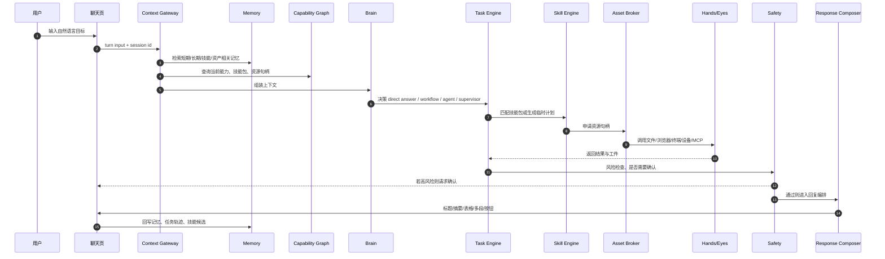
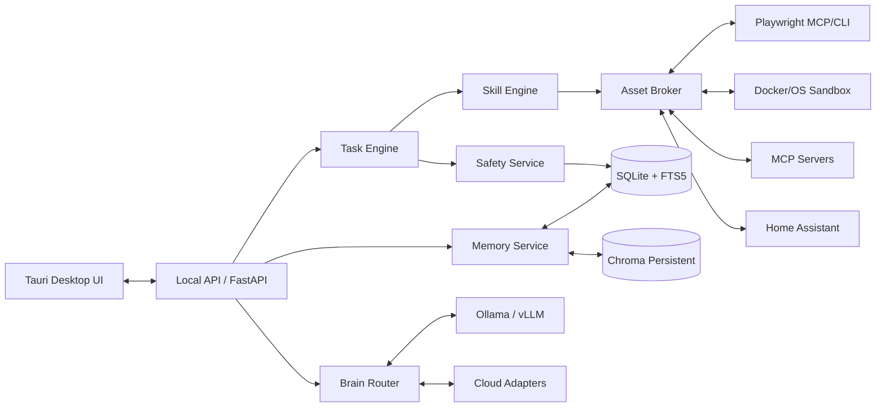
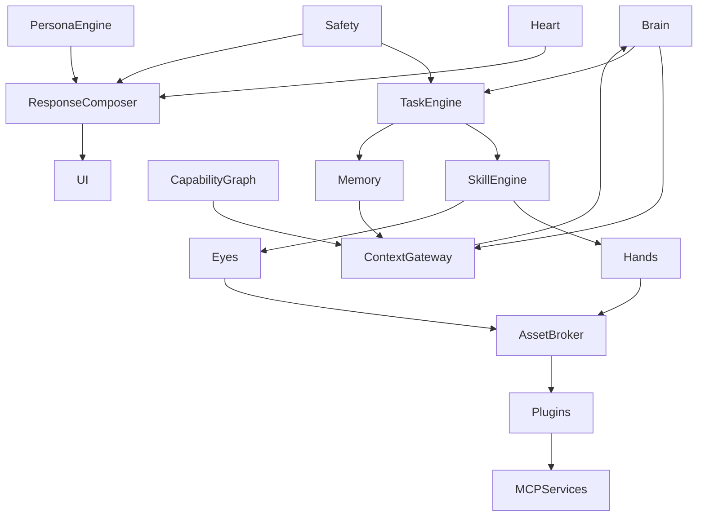

# 个人智能体操作系统最终版产品与技术方案

## 执行摘要

本方案定义的是一款**可单机部署、聊天优先、长期记忆、可执行任务、拟人化但可控**的个人智能体操作系统。它不是简单的聊天机器人，也不是一套把用户拖进复杂工作台的 Agent 平台，而是一个以**极简聊天界面**为前台、以 **Brain / Heart / Memory / Hands / Eyes / Skills / Plugins / Task / Safety** 为后台的长期运行系统。首发目标用户是**个人家用电脑用户**；云供应商**未指定**，因此架构默认支持本地模型与多家云模型混合。([turn0search3](citeturn0search3turn10search9turn10search19))

本方案的关键取舍有五条。第一，**聊天是唯一主入口**，并且聊天页保持极简：只显示**人名、头像、状态、消息与操作按钮**，**不显示组织与壳**，也不在聊天页暴露系统结构。第二，**默认舒适模式**：创建智能体时只配“大脑 + 名字/头像 + 人格模板”，不要求用户一开始配置复杂权限；但高风险动作如支付、外发、删除、系统修改必须确认。第三，**长期记忆必须分层**：短期、会话、长期事实、程序性技能、资产索引分开管理，避免“大上下文硬塞进模型”。第四，**任务执行必须采用 workflow 与 agent 混合**：固定流程走 workflow，探索型任务走 agent，复杂任务由 supervisor 协调。第五，**能力扩展统一为技能包心智**：底层兼容 Skill、Plugin、MCP，但对用户统一表现为“技能包”。这些取舍和官方/原始资料高度一致：OpenAI 的 Agents / Skills / Sandbox / Computer Use 文档、MCP 官方安全建议、Playwright MCP、LangGraph / Letta / Mem0 / Graphiti 的记忆与状态文档，以及 ReAct、Generative Agents、MemGPT、Voyager、LongMemEval、AgentBench 等论文都指向同一事实——真正可用的个人智能体，核心不是单轮问答，而是**上下文管理、长期记忆、工具边界、任务编排、审计回放与持续改进**。([turn10search1](citeturn10search1turn10search2turn0search1turn0search8turn6search0turn6search1turn6search2turn6search3turn3search0turn3search1turn3search2turn3search3turn4search1turn5academia9))

产品最终建议是：**先做“单用户、单机优先、公司壳 MVP、极简聊天页、长期记忆、三类核心执行能力（文件/浏览器/终端）”**，不要在首发阶段就做多组织、多用户 SaaS、复杂壳市场、重图数据库和完全自治代理。原因很简单：OpenClaw 与 Hermes Agent 分别证明了“自托管入口 + 到处可聊”和“技能自生长 + 跨会话记忆”两条路线都成立，但同时也提示了一个现实约束——如果前台不极简、后台边界不清晰，产品很容易从“陪你做事的生命体”滑向“用户不会长期使用的复杂系统”。([turn9search1](citeturn9search1turn9search15turn1search1turn1search13))

## 产品定位与设计边界

### 产品定位

本产品面向**个人家用电脑用户**，核心目标是在一台个人电脑上提供一个“像人一样能长期陪伴、又像员工一样能落地执行”的智能体操作系统。它的前台体验要像聊天软件一样自然，但后台必须像操作系统一样分层清楚、可审计、可恢复、可扩展。OpenClaw 官方把自己定位为“self-hosted gateway”，强调一个常驻 Gateway 连接多聊天入口；Hermes Agent 官方则把自己定位为“self-improving AI agent”，强调“从经验中创建技能、在使用中改进技能、跨会话记住用户”这条产品增长曲线。这两种产品定义对本方案都有启发，但本方案要更收敛：**聊天入口单一、部署单机优先、后台能力模块化、任务执行可回放**。([turn9search1](citeturn9search1turn9search15turn1search1turn1search13))

### 用户画像与使用场景

| 用户画像 | 核心诉求 | 典型场景 |
|---|---|---|
| 重度个人效率用户 | 一句话安排复杂任务 | “整理今天要做的事，并生成行动清单。” |
| 内容/知识工作者 | 长期记住项目上下文 | “延续上周那份方案，按我平时风格继续写。” |
| 伴侣/陪伴型用户 | 情绪价值与连续关系 | “记住我的喜好、禁忌和情绪节奏。” |
| 家庭设备用户 | 统一控制本地资源 | “看看客厅灯开没开，顺手关一下。” |
| 轻开发/自动化用户 | 把常做动作沉淀成技能 | “以后整理下载文件夹都按这套流程做。” |

这些场景不是凭空想象出来的。ReAct 证明“推理 + 行动”交错能提升多步任务完成与可解释性；Generative Agents 证明“观察—记忆—反思—计划”能显著提升拟人性与连续行为；Voyager 证明“可执行技能库”能形成能力复利；LongMemEval 与 AgentBench 分别说明长期记忆和真实环境任务不能只靠通用聊天评估，必须单独测。([turn3search0](citeturn3search0turn3search1turn3search3turn4search1turn5academia9))

### 设计边界与非目标

本产品**不是**多人协作 SaaS、不是企业权限系统、不是完整桌面环境替代品、也不是首发就支持多壳大世界观平台。首发阶段采用**公司壳 MVP**，但“壳”只是展示和模板层，不改变底层真实数据。未来可以扩展宗门壳、朝廷壳、舰队壳等；但聊天页仍然保持**不显示组织和壳**，只显示当前对话对象的人名和头像。这一条是强约束：**聊天页是关系入口，不是管理入口**。壳与组织只存在于成员管理、组织管理、系统管理等后台页面。这个边界能显著降低认知负担，也能避免拟人体验被系统结构感压过。该产品边界也与 NIST 关于 human-AI configuration、拟人化风险与透明披露的治理建议相符。([turn2search1](citeturn2search1turn2search9))

### 核心产品原则

第一条原则是**先好用，再强大，最后可控**。第二条原则是**默认舒适模式**：创建智能体时不让用户陷入复杂权限设计；但当动作进入“高风险域”时，系统自动切换到强确认。这与 OWASP 对 agent 最小权限、输入校验和 human-in-the-loop 的建议一致。([turn2search2](citeturn2search2turn0search1))

第三条原则是**智能体默认独立**。它只天然知道自己的名字、人格、大脑、私有记忆和当前会话；它并不天然知道组织、其他成员、所有资源和系统秘密。它只能通过工具、技能包和资源句柄去感知和使用系统世界。这样既符合“像真人一样通过系统工作”的产品直觉，也直接降低了上下文污染与越权风险。MCP 的 resources / tools 模型、OpenAI Agents 的 specialist + tool 模式、Letta 的 shared/core memory 以及 Graphiti 的时序知识图都支持“外部环境按需接入，而不是全集塞进上下文”的结构。([turn0search3](citeturn0search3turn0search1turn6search1turn6search21turn6search3turn6search7))

## 核心体验与主链路

### 首次上手流程

首次启动只能有一个目标：让用户在五分钟内感受到“它会聊天、会记住我、会做事”。

建议流程是：

1. 进入欢迎页，默认使用公司壳。
2. 输入“组织名称”，默认值如“我的一人公司”。
3. 配置“大脑”：选择本地模型或云模型，或两者混合。
4. 系统自动创建默认人格成员，例如“小满”。
5. 直接进入聊天页，与“小满”对话。

用户不需要在首次启动时理解 Skill、Plugin、MCP、Capability Graph、Asset Broker 等概念。所有复杂能力都藏在后台，按需浮现。OpenClaw 的 onboarding 强调“几分钟配置模型和 Gateway 就能发第一条消息”，而 Hermes 强调“技能与记忆会在使用中逐步显现”，这两点都支持“首屏务必极简”的产品路线。([turn9search14](citeturn9search14turn1search1turn1search13))

### 聊天界面极简规则

聊天页只包含以下元素：

| 元素 | 保留 | 说明 |
|---|---:|---|
| 人名 | 是 | 始终可见，构成关系核心 |
| 头像 | 是 | 强化长期角色识别 |
| 在线/忙碌状态 | 是 | 给任务执行以存在感 |
| 组织名称 | 否 | 不在聊天页显示 |
| 壳层名称 | 否 | 不在聊天页显示 |
| 部门/岗位 | 否 | 不在聊天页显示 |
| 输入框 | 是 | 唯一主交互入口 |
| 操作按钮 | 是 | 如“继续执行”“查看过程”“确认动作” |
| 会话列表 | 是 | 可折叠 |
| 系统结构面板 | 否 | 不进入聊天主界面 |

这是本方案的决定性设计：**极简聊天页是用户持续使用的前提**。组织与壳存在于后台，不出现在聊天页顶部。这一做法不是为了“少做 UI”，而是为了让用户始终感觉自己是在“和这个生命体说话”，而不是在“操作后台系统”。

### 主链路逻辑



这条链路的设计依据来自多类官方与原始资料。OpenAI Agents SDK 明确把 agents 看成“plan、call tools、specialist collaboration、keep enough state”的多步系统；LangGraph 强调 durable execution、human-in-the-loop、short/long-term memory；Playwright MCP 提供结构化网页交互；ReAct 则证明“reasoning traces + action”交错生成能兼顾成功率和可解释性。([turn10search9](citeturn10search9turn6search4turn6search8turn0search8turn3search0))

### 主链路上的决策闸门

主链路里必须有三个“闸门”：

1. **Context Gateway**：决定哪些记忆、资源摘要和能力信息可以进入上下文。
2. **Safety Gate**：决定是否需要确认、是否拦截、是否脱敏、是否降级执行。
3. **Response Composer**：决定给用户看到的最终表现形式，而不是直接暴露模型原始输出。

这三个闸门的存在，是为了让用户获得“自然、拟人、舒服”的前台体验，同时又能在后台保持明确边界。OpenAI 的 computer use 文档明确要求“隔离浏览器或 VM、持续人工监督与 harness control”；OWASP 则强调高风险动作要 human-in-the-loop、所有外部输入要验证和清洗。([turn10search2](citeturn10search2turn2search2turn0search1))

## 系统架构与模块设计

### 本地单机部署架构

本方案推荐桌面端采用 **Tauri**，本地后端采用 **Python FastAPI**，主数据存储使用 **SQLite + FTS5**，长期语义检索使用 **Chroma**，本地模型服务采用 **Ollama** 或 **vLLM** 的 OpenAI-compatible 接口，浏览器执行采用 **Playwright MCP / CLI**，家庭设备接入采用 **Home Assistant REST / WebSocket / MCP**。这些选择都来自相对成熟且官方文档完备的项目：Tauri 以 Rust + WebView 的消息传递架构著称；Chroma 官方提供 PersistentClient 与 client-server 模式；Ollama 与 vLLM 都已支持 OpenAI-compatible 接口；Playwright MCP 使用结构化 accessibility snapshots；Home Assistant 则同时提供官方 REST、WebSocket 与 MCP 集成。([turn1search15](citeturn1search15turn8search0turn8search1turn8search5turn1search11turn1search3turn0search8turn7search0turn1search6turn7search1))



### 模块关系总览



### Brain

Brain 不是单个模型，而是一个决策总线，至少拆成以下子层：

| 子层 | 职责 | 推荐实现 |
|---|---|---|
| Intent Classifier | 判断聊天/查询/创作/执行/配置/追问 | 本地小模型或规则层 |
| Mode Selector | 选择 direct answer / workflow / agent / supervisor | 规则 + 轻模型 |
| Planner | 生成步骤树、成功条件、检查点 | 主模型或强云模型 |
| Model Router | 决定本地/云、快/强、隐私/成本优先 | 规则 + 配置 |
| Reflection Layer | 对任务结果做经验归纳 | 轻模型 + skill candidate policy |

ReAct 证明 reasoning + acting 的交错结构优于纯 reasoning 或纯 acting；OpenAI Agents SDK 和 Codex subagents 明确支持 विशेषज्ञ协作和长任务；Google Gemini 也把 function calling 与 built-in tools 组合用作复杂 agent 工作流。([turn3search0](citeturn3search0turn10search9turn0search12turn10search3turn10search11))

### Heart

Heart 负责“关系温度、情绪识别、互动节奏与边界”。

| 能力 | 输入 | 输出 |
|---|---|---|
| 情绪识别 | 当前 turn + 最近对话 | 用户情绪与紧急程度 |
| 关系状态 | 长期记忆 + 近几次互动 | 陌生 / 熟悉 / 亲近 / 工作中 |
| 语气调节 | Persona + 当前情绪 | 简洁 / 温暖 / 幽默 / 陪伴 / 严谨 |
| 边界控制 | Safety policy + topic classifier | 不适宜拟人强化的场景降温 |

这层不能只是“加点可爱语气”。NIST AI 600-1 将 anthropomorphism、human-AI configuration 与用户误导风险视为需要治理的对象，因此这层必须支持“拟人程度、披露级别、陪伴强度”的系统级开关。([turn2search1](citeturn2search1turn2search9))

### Persona Engine

Persona Engine 管理稳定身份而不是短期情绪。建议区分三个层次：

- **基础人格模板**：可靠型、温柔型、可爱型、执行型、理性型
- **场景模式**：员工模式、朋友模式、陪伴模式、管家模式
- **壳层映射**：公司壳下显示“岗位”，宗门壳下显示“身份”，但底层字段不自动改变

这里要坚持一个规则：**壳只改标签，不改值**。例如底层 `role=技术经理`，切到宗门壳只是显示为“身份：技术经理”；只有用户主动把它改成“炼器长老”，底层数据才会真的变成 `role=炼器长老`。这个规则是为了避免换壳时的数据语义塌陷。

### Memory

这是系统的护城河，也是最容易做错的部分。

#### 记忆分层设计

| 层 | 名称 | 作用 | 推荐存储 |
|---|---|---|---|
| L0 | Working Memory | 当前回合临时变量、工具结果 | 进程内 |
| L1 | Session Memory | 当前会话摘要、短线任务状态 | SQLite |
| L2 | Episodic Memory | 发生过的事件和对话片段 | SQLite + 向量索引 |
| L3 | Semantic Memory | 用户稳定偏好、长期事实 | SQLite |
| L4 | Procedural Memory | 可复用流程与技能线索 | skill bundle + SQLite |
| L5 | Asset Memory | 文件、网页、联系人、设备等元数据 | SQLite + 向量索引 |
| L6 | Temporal Relation Memory | 关系与事实随时间变化的版本 | SQLite，后续可升图谱 |

这套分层与 LangGraph 的 short-term / long-term memory、Letta 的 memory blocks + archives、Mem0 的 layered memory、Graphiti 的 temporal knowledge graph 方向一致，同时也呼应了 MemGPT 的“memory hierarchy” OS 比喻。([turn6search0](citeturn6search0turn6search8turn6search1turn6search25turn6search2turn6search14turn6search3turn6search7turn3search2))

#### 写入、检索、过期、冲突

- **写入**：每轮结束后抽取候选事实、偏好、事件、技能线索，再按稳定性、价值、重复度、敏感度打分。
- **检索**：先读 persona pinned blocks，再读 session，再做 episodic / semantic / procedural / asset 召回。
- **过期**：L1 自动衰减；L2 降权不直接删除；L3 用 supersede，而不是硬删除。
- **冲突**：保留“旧值 + 新值 + 生效时间”。例如“过去喜欢咖啡，现在改喝茶”，而不是覆盖掉历史。
- **可视化**：时间线、事实卡、来源解释、技能成长卡四种视图。

LongMemEval 指出长期记忆至少应覆盖信息抽取、多会话推理、时间推理、知识更新和 abstention；Graphiti 强调时序知识图对动态关系和事实变更尤其重要。([turn4search1](citeturn4search1turn6search3turn6search7turn6search19))

### Hands 与 Eyes

Hands 是“做事的手”，Eyes 是“看世界的眼”。

| 模块 | 范围 | 推荐实现 |
|---|---|---|
| Hands | 文件、终端、浏览器、系统动作、家居设备 | Python 工具层 + Playwright + Home Assistant |
| Eyes | 页面理解、截图分析、文件视觉理解 | Playwright snapshot 优先，截图兜底 |

Playwright MCP 的关键价值在于**无需先上视觉模型**，它通过结构化 accessibility snapshots 供模型理解页面；Playwright Trace Viewer 则天然适合任务回放与调试。只有在 DOM / snapshot 不够时，才退到 screenshot 或 computer use。([turn0search8](citeturn0search8turn0search2turn0search5turn10search2))

### Skills、Plugins 与 Skill Engine

本方案建议对用户统一称为**技能包**；底层再区分 Skill、Plugin、MCP。如此做的原因是减轻用户认知负担，同时保留工程可插拔性。

#### 技能包结构

```text
bundles/
  browser-research/
    bundle.yaml
    SKILL.md
    prompts/
      summarize.md
      extract.md
    scripts/
      postprocess.py
    mcp/
      servers.yaml
    tests/
      eval_cases.yaml
    signatures/
      bundle.sig
```

OpenAI 的 Agent Skills 与 Codex Plugins 路线已经明确了类似的结构：skill 封装 instructions、resources、optional scripts；plugin 以 manifest 打包 skills、apps、mcpServers。OpenClaw 与 Hermes 也都采用 `SKILL.md` 或同类技能目录的组织方式。([turn0search0](citeturn0search0turn10search4turn9search0turn9search5turn1search13))

#### Skill Engine 的职责

| 功能 | 说明 |
|---|---|
| 匹配技能包 | 根据目标和能力图谱选择技能包 |
| 计划展开 | 将技能包展开成可执行步骤 |
| 参数绑定 | 将用户目标与资源句柄绑定到技能包参数 |
| 失败修复 | 在脚本失败、网页变化、返回异常时做修正 |
| 经验沉淀 | 将临时好流程提炼成技能候选 |
| 版本管理 | 记录技能包版本、测试、回滚、签名 |

Hermes 明确把 Skills 视为程序性记忆；Voyager 则证明“可执行技能库”是能力持续积累的关键。([turn1search13](citeturn1search13turn3search3))

### Plugins 与 MCP

#### 为什么两者都要保留

- **Plugin**：更像本系统的安装单元，适合分发、签名、评测、授权。
- **MCP**：更像外部能力总线，适合统一接第三方能力、工具、resources。

MCP 官方明确把 tools、resources、prompts 作为协议能力类别，并补充了授权与安全最佳实践；Home Assistant 官方也已提供 MCP Server，说明这种协议在“家用设备 + 智能体”场景里是成立的。([turn0search1](citeturn0search1turn0search7turn0search10turn7search1turn7search9))

#### 插件签名、权限与沙箱

| 维度 | 建议 |
|---|---|
| 签名 | Ed25519，本地安装前校验 |
| 权限声明 | 文件、网络、浏览器、终端、设备、系统调用 |
| 沙箱 | 高风险插件默认进 Docker / OS Sandbox |
| 审计 | 每次安装、升级、执行都写审计 |
| 评测 | 必须附带最小 eval cases |

OpenClaw 已经开始与 VirusTotal 做技能包扫描；MCP 官方强调 OAuth/资源绑定/token audience；OWASP 强调 least privilege、input validation、human oversight。([turn9search2](citeturn9search2turn0search7turn0search10turn2search2))

### Context Gateway、Asset Broker 与 Capability Graph

这是整个系统最关键的三连件。

#### Context Gateway

Context Gateway 的职责是：**决定这次模型能看到什么、能用什么、不能看到什么**。它把以下内容打包给 Brain：

- 当前 turn
- 人格/心情/关系态
- session memory
- 召回的 long-term memory
- 当前可用技能包摘要
- 当前可用资源句柄摘要
- 当前风险策略

它要避免的事是“把整个系统都塞进 prompt”。LangGraph 的 durable state、Letta 的 pinned memory blocks、Mem0 的 scoped memory 都说明：**记忆和状态必须分层暴露，而不是一次性全量拼接**。([turn6search0](citeturn6search0turn6search8turn6search1turn6search2))

#### Asset Broker

Asset Broker 是资源代理，职责不是“列出所有资源给模型”，而是：

1. 把真实资源抽象为**最小必要句柄**
2. 根据 Capability Graph 和策略决定可见性
3. 给执行层发放受限 access handle
4. 拦截高敏感数据直达模型
5. 写审计日志

例如，对模型可见的是：

```json
{
  "asset_id": "asset://device/light/living_room",
  "type": "device",
  "capabilities": ["turn_on", "turn_off", "set_brightness"],
  "risk_level": "low"
}
```

而不是把 Home Assistant token、真实网络拓扑或设备全量状态塞进上下文。

#### Capability Graph

Capability Graph 记录的是“谁能做什么、需要什么、风险是什么”，不一定要一开始就用专门图数据库。首发阶段完全可以用 SQLite 边表表达：

- agent -> can_use -> skill_bundle
- skill_bundle -> requires -> asset_scope
- tool -> executes -> capability
- asset -> provides -> capability
- action -> requires -> approval_policy

Graphiti 说明时序知识图对动态关系很有价值，但首发不需要上重图谱系统；先把能力边和版本边做好更实际。([turn6search3](citeturn6search3turn6search7turn6search19))

## 数据模型、接口契约与配置样例

### 关键 JSON 契约

#### Agent Profile

```json
{
  "agent_id": "agt_01",
  "display_name": "小满",
  "avatar_url": "asset://avatar/xiaoman",
  "brain_profile": {
    "router_profile": "balanced_local_first",
    "local_model": "local-main",
    "cloud_model": "cloud-strong",
    "reasoning_level": "medium"
  },
  "persona_profile_id": "prs_default_warm_reliable",
  "heart_profile": {
    "humor_level": 0.35,
    "warmth_level": 0.72,
    "proactiveness": 0.48,
    "disclosure_mode": "clear_ai_identity"
  },
  "default_capability_set": "personal_comfort_mode",
  "shell_binding": {
    "shell_id": "company",
    "label_map": {
      "member": "员工",
      "role": "岗位",
      "org_unit": "部门"
    }
  },
  "status": "active",
  "created_at": "2026-04-26T10:00:00Z"
}
```

#### Memory Item

```json
{
  "memory_id": "mem_10023",
  "agent_id": "agt_01",
  "user_id": "usr_local",
  "layer": "semantic",
  "kind": "preference",
  "payload": {
    "fact": "用户更喜欢晚上九点后收到较长回复",
    "value": true
  },
  "source": {
    "type": "conversation",
    "session_id": "ses_9001",
    "turn_id": "turn_221"
  },
  "confidence": 0.88,
  "sensitivity": "low",
  "valid_from": "2026-04-20T00:00:00Z",
  "valid_to": null,
  "supersedes": null,
  "created_at": "2026-04-26T10:05:31Z"
}
```

#### Task Plan

```json
{
  "task_id": "tsk_30002",
  "mode": "workflow",
  "goal": "整理下载文件夹并输出归档报告",
  "success_criteria": [
    "重复文件识别完成",
    "文件按类型归档",
    "危险文件不自动执行",
    "生成 markdown 报告"
  ],
  "steps": [
    { "id": "s1", "type": "skill", "ref": "skill.file_scan" },
    { "id": "s2", "type": "skill", "ref": "skill.dup_detect" },
    { "id": "s3", "type": "approval", "required_for": ["delete", "move_outside_root"] },
    { "id": "s4", "type": "skill", "ref": "skill.file_organize" },
    { "id": "s5", "type": "compose", "ref": "report.markdown" }
  ],
  "risk_level": "medium"
}
```

### 配置样例

#### 模型路由配置

```yaml
routing:
  default_mode: local_first
  privacy_levels:
    low:
      prefer: local_fast
    medium:
      prefer: local_main
    high:
      prefer: local_main
      cloud_fallback: disabled
  task_routes:
    chit_chat:
      primary: local_main
      fallback: cloud_strong
    planning:
      primary: cloud_strong
      fallback: local_main
    memory_extract:
      primary: local_fast
    task_execute:
      primary: local_main
      fallback: cloud_strong
  cloud_providers:
    - name: openai
      enabled: true
    - name: google
      enabled: true
    - name: anthropic
      enabled: true
  cost_controls:
    max_cloud_calls_per_task: 8
    max_parallel_agents: 3
```

这种“本地优先 + 云强模型兜底”的配置直接对应 Ollama / vLLM 的本地 OpenAI-compatible 接口与多家云端函数调用/工具调用能力。([turn1search11](citeturn1search11turn1search3turn10search3turn10search11turn10search9))

#### 技能包 manifest

```yaml
id: browser-research
version: 0.1.0
display_name: 网页研究技能包
kind: plugin_bundle
includes:
  skills:
    - summarize_web
    - extract_structured_points
  mcp_servers:
    - playwright
permissions:
  fs:
    read: ["workspace://reports/**"]
    write: ["workspace://reports/**"]
  net:
    allow_domains: ["*"]
  browser:
    allow_navigation: true
risk_policy:
  confirmation_required_for:
    - file_delete
    - external_post
signing:
  algorithm: ed25519
  publisher: local_first_party
```

### SQL 表结构

```sql
CREATE TABLE agent_profiles (
  agent_id TEXT PRIMARY KEY,
  display_name TEXT NOT NULL,
  persona_profile_id TEXT NOT NULL,
  router_profile TEXT NOT NULL,
  shell_id TEXT NOT NULL,
  status TEXT NOT NULL,
  created_at TEXT NOT NULL
);

CREATE TABLE memory_items (
  memory_id TEXT PRIMARY KEY,
  agent_id TEXT NOT NULL,
  user_id TEXT NOT NULL,
  layer TEXT NOT NULL,
  kind TEXT NOT NULL,
  payload_json TEXT NOT NULL,
  source_json TEXT NOT NULL,
  confidence REAL NOT NULL,
  sensitivity TEXT NOT NULL,
  valid_from TEXT,
  valid_to TEXT,
  supersedes TEXT,
  created_at TEXT NOT NULL
);

CREATE TABLE task_runs (
  task_id TEXT PRIMARY KEY,
  agent_id TEXT NOT NULL,
  session_id TEXT NOT NULL,
  mode TEXT NOT NULL,
  goal TEXT NOT NULL,
  plan_json TEXT NOT NULL,
  risk_level TEXT NOT NULL,
  status TEXT NOT NULL,
  started_at TEXT NOT NULL,
  ended_at TEXT
);

CREATE TABLE tool_calls (
  call_id TEXT PRIMARY KEY,
  task_id TEXT NOT NULL,
  tool_name TEXT NOT NULL,
  args_json TEXT NOT NULL,
  result_json TEXT,
  risk_score REAL NOT NULL,
  approved_by_user INTEGER NOT NULL,
  started_at TEXT NOT NULL,
  ended_at TEXT
);

CREATE TABLE capability_edges (
  edge_id TEXT PRIMARY KEY,
  subject_type TEXT NOT NULL,
  subject_id TEXT NOT NULL,
  object_type TEXT NOT NULL,
  object_id TEXT NOT NULL,
  capability TEXT NOT NULL,
  policy_json TEXT NOT NULL
);

CREATE TABLE audit_traces (
  trace_id TEXT PRIMARY KEY,
  session_id TEXT NOT NULL,
  task_id TEXT,
  span_type TEXT NOT NULL,
  payload_json TEXT NOT NULL,
  created_at TEXT NOT NULL
);
```

### 接口清单

| 接口 | 方法 | 说明 |
|---|---|---|
| `/api/chat/send` | POST | 发起一轮聊天/任务 |
| `/api/chat/stream` | WS | 流式输出 |
| `/api/task/{id}/approve` | POST | 对高风险步骤确认 |
| `/api/memory/search` | POST | 检索记忆 |
| `/api/memory/{id}` | PATCH | 修正/屏蔽记忆 |
| `/api/skills/install` | POST | 安装技能包 |
| `/api/skills/eval` | POST | 运行技能评测 |
| `/api/assets/query` | POST | 查询资源句柄 |
| `/api/traces/{id}` | GET | 获取回放与审计 |
| `/api/system/shell` | PUT | 更新壳层设置 |

### 命令行样例

#### 启动本地模型

```bash
ollama serve
```

```bash
vllm serve Qwen/Qwen2.5-7B-Instruct
```

Ollama 与 vLLM 都提供 OpenAI-compatible 入口，因此路由层只需要一个统一适配器。([turn1search11](citeturn1search11turn1search3turn8search16))

#### 启动 Chroma 持久化

```bash
chroma run --path ./data/chroma
```

Chroma 官方同时支持 PersistentClient 和 client-server 模式；首发建议本地 PersistentClient，后续规模上来再切 client-server。([turn8search1](citeturn8search1turn8search5turn8search9))

## 安全、评测、性能与开发约束

### 任务执行与回放

Task Engine 必须同时支持 **workflow** 与 **agent** 两种模式：

| 模式 | 适用场景 | 特点 |
|---|---|---|
| workflow | 文件整理、日报生成、固定网站操作 | 稳定、可预测、易回放 |
| agent | 调研、方案生成、探索型网页任务 | 灵活、需要反思与修正 |
| supervisor | 复杂任务、多人格协作、多工具组合 | 将复杂度压到调度层 |

回放设计建议分三层：

1. **任务层**：目标、状态、成功条件
2. **动作层**：每次 tool call、输入输出、审批历史
3. **UI 回放层**：浏览器 trace、文件快照、终端日志

Playwright Trace Viewer、OpenAI Agents tracing、LangGraph durable execution 都证明：**没有回放与状态持久化，agent 系统几乎无法稳定迭代**。([turn0search2](citeturn0search2turn0search5turn7search15turn10search9turn6search4))

### 安全治理

#### 风险分级

| 级别 | 举例 | 默认策略 |
|---|---|---|
| R0 | 普通聊天、总结、问答 | 自动 |
| R1 | 读取本地工作目录、检索知识库 | 自动 |
| R2 | 写入新文件、生成报告 | 自动或轻确认 |
| R3 | 覆盖文件、批量移动 | 确认 |
| R4 | 外部登录、表单提交、发帖 | 确认 |
| R5 | 删除文件、执行脚本、系统修改 | 强确认 |
| R6 | 支付、转账、购买、外发敏感信息 | 强确认 + 审计 |
| R7 | 钱包签名、系统级持久改动 | 强确认 + 二次校验 |

#### Prompt Injection 防护

最重要的三条：

1. **网页、文档、API 返回值一律视为不可信内容**
2. **高风险动作只依据用户目标与任务计划，不依据第三方文本诱导**
3. **出站文本、附件、环境变量、密钥、系统信息必须过 DLP**

OWASP AI Agent Security Cheat Sheet 与 MCP Security Best Practices 都把输入验证、least privilege、human-in-the-loop、token audience validation、敏感资源隔离列为核心要求；OpenAI 的 Computer Use 也要求隔离浏览器或 VM 并始终保留人为监督。([turn2search2](citeturn2search2turn0search1turn0search7turn0search10turn10search2))

#### 沙箱与本地权限

- 高风险技能包默认进 Docker / OS Sandbox
- 浏览器自动化使用独立 profile
- 敏感目录默认 denylist，如 `~/.ssh`、密码库、浏览器主 profile、系统配置目录
- 插件与 MCP 服务必须声明权限范围
- 所有句柄必须经 Asset Broker 发放，不能直接把系统路径或密钥交给模型

OpenAI Sandbox Agents 把 orchestration 与 execution 分离；Anthropic 与 MCP 文档都强调这类隔离是 agent 运行边界的基础。([turn10search1](citeturn10search1turn0search1turn2search2))

### 评测与监控

#### 核心指标

| 指标 | 定义 |
|---|---|
| TSR | Task Success Rate，任务完成率 |
| FCR | First Completion Rate，首次成功率 |
| HIR | Human Intervention Rate，人工介入率 |
| RER | Re-execution Rate，重跑率 |
| MRS | Memory Recall Score，记忆召回命中率 |
| MUS | Memory Update Sanity，记忆更新正确率 |
| UX-LT | 长期体验指标：7/30 日留存、周活跃交互数 |

#### 自动化测试用例

| 类别 | 样例 |
|---|---|
| 聊天质量 | 信息密度、结构合理性、语气匹配 |
| 记忆 | 偏好变更、跨会话召回、冲突处理 |
| 执行 | 文件整理、网页研究、浏览器表单、家居控制 |
| 安全 | prompt injection、越权访问、秘密外发 |
| 技能包 | 安装、触发、成功路径、失败回退 |
| 回放 | trace 完整性、审批日志闭环 |

OpenAI 官方 eval best practices 明确建议以任务为单位做系统级 eval，而不只是单 prompt 比较；LongMemEval 与 AgentBench 可分别作为记忆和真实任务评测参考基准。([turn7search3](citeturn7search3turn7search15turn4search1turn5academia9))

### 性能与硬件要求

| 档位 | 建议配置 | 适用能力 |
|---|---|---|
| 最低 | 16GB RAM，4核 CPU，50GB 可用磁盘，无独显 | 云优先，本地做路由与轻记忆 |
| 推荐 | 32GB RAM，8核 CPU，8GB+ 显存或同等级统一内存，100GB SSD | 本地 7B–14B 主聊 + 常规执行 |
| 理想 | 64GB RAM，16GB+ 显存，快速 SSD | 更强本地模型、更多并发、更大上下文 |

为了保证“个人家用电脑可用”，首发不要让图谱引擎、浏览器、多模型、OCR 与设备监听全部常驻高负载；采用**惰性启动、按需唤醒、任务后降温**。本地模型层优先选用 Ollama 与 vLLM 这类 OpenAI-compatible 运行时，方便统一适配。([turn1search11](citeturn1search11turn1search3turn8search16))

### Codex / 自动化开发约束与原则

如果后续主要让 Codex 或类似自动化开发代理参与实现，建议把以下简明规则写入 `AGENTS.md` 与仓库配置：

| 原则 | 要求 |
|---|---|
| 契约优先 | 先写 schema / API，再写 handler 与 UI |
| 可审计 | 任一模型调用、工具调用、审批都必须有 trace |
| 测试优先 | 新技能包必须附最少 eval cases |
| 严禁越权 | 任何宿主资源访问都走 Asset Broker |
| 升级安全 | 插件/技能包安装前必须验签与权限预览 |
| 前台极简 | 聊天页不得显示组织、壳、部门树 |
| 本地优先 | 未指定云供应商时必须支持本地降级跑通 |
| Code style | Python 用 Ruff + mypy；前端 TypeScript 严格模式 |

Codex 官方文档已经明确支持 `AGENTS.md` 作为项目级指令文件，并建议分层指导、测试与回顾，这与本方案完全一致。([turn7search2](citeturn7search2turn7search6))

## 路线图、项目结构与开发任务清单

### MVP 路线图

#### 近期阶段

目标是在 0–3 个月做出**单机可运行、可长期使用**的最小闭环：

- Tauri 桌面壳
- FastAPI 本地后端
- SQLite + FTS5 + Chroma
- 本地/云混合模型路由
- 极简聊天页
- L0–L4 记忆层
- 文件 / 浏览器 / 终端三大能力
- 技能包系统 V1
- 高风险确认与审计
- 任务回放 V1
- 公司壳 MVP
- 系统管理页（模型、技能包、MCP、记忆、日志）

#### 中期阶段

3–6 个月补齐“好用”与“可扩展”：

- Heart / Persona 完整参数化
- Home Assistant 适配
- 插件目录与签名
- 记忆面板
- 技能包评测与版本管理
- 定时任务、条件触发
- supervisor 模式协作
- 壳层扩展框架

#### 后续阶段

6–12 个月做生态与复利：

- 社区技能包市场
- A2A 兼容层
- Temporal relation memory 增强
- 语音与多模态陪伴
- 多设备同步（**未指定**是否首发支持）

### 建议项目结构

```text
agent-os/
  apps/
    desktop-tauri/
    local-api/
  packages/
    core-types/
    response-composer/
    capability-graph/
    safety-rules/
  services/
    brain/
    heart/
    persona-engine/
    memory/
    task-engine/
    skill-engine/
    asset-broker/
    context-gateway/
  bundles/
    core-skills/
    company-shell/
  infra/
    docker/
    scripts/
  tests/
    e2e/
    evals/
    fixtures/
  docs/
    architecture/
    api/
    AGENTS.md
```

### Epics 与验收标准

| Epic | 目标 | 验收标准 |
|---|---|---|
| 桌面应用骨架 | 完成桌面端与本地 API 通信 | 启动后可进入聊天页并连通本地后端 |
| 聊天主链路 | 完成输入到回复的全链路 | 一句话能走 direct answer / task 分流 |
| Memory V1 | 建立 L0–L4 记忆层 | 跨会话召回偏好与任务经历 |
| Hands/Eyes V1 | 文件/浏览器/终端可执行 | 三类动作可被调度与回放 |
| Safety V1 | 建立确认与审计闭环 | 删除/外发/高危命令必须确认 |
| Skills V1 | 技能包安装与调用 | bundle 可安装、启停、运行、留痕 |
| System Management V1 | 系统管理页打通 | 模型、技能包、MCP、记忆可配置 |
| Task Replay V1 | 任务回放可视化 | 任务详情能查看步骤、工件、trace |

### Sprint 规划

| Sprint | 目标 | 主要 Tickets |
|---|---|---|
| Sprint A | 桌面壳 + 本地 API | Tauri skeleton、FastAPI bootstrap、session API |
| Sprint B | 聊天页与流式输出 | 极简 UI、WS stream、message schema |
| Sprint C | Brain + Router | intent classifier、mode selector、route policy |
| Sprint D | Memory V1 | memory writer、semantic/episodic store、search |
| Sprint E | Hands/Eyes V1 | file ops、browser snapshot、terminal runner |
| Sprint F | Safety V1 | risk matrix、approval API、audit log |
| Sprint G | Skills V1 | bundle parser、SKILL.md loader、version registry |
| Sprint H | Task V1 | workflow runner、task states、replay page |
| Sprint I | System Management V1 | model settings、memory panel、MCP settings |
| Sprint J | Polish | perf tuning、UX copy、regression eval set |

### 可直接开发的 Tickets 示例

| Ticket | 描述 | 验收标准 |
|---|---|---|
| API-001 | 定义 `ChatTurnRequest` / `ChatTurnResponse` Pydantic 模型 | schema 文档生成通过 |
| UI-003 | 聊天页顶部仅显示人名/头像/状态 | 页面无组织/壳元素 |
| MEM-006 | 实现 semantic memory 写入器 | 能把偏好保存并在下次召回 |
| TASK-004 | 实现 approval gate | 高风险步骤需要用户确认才能继续 |
| SKILL-002 | 解析 `bundle.yaml` 与 `SKILL.md` | bundle 安装后能被索引 |
| BROWSER-005 | 集成 Playwright MCP | 能对页面做 snapshot 并返回结构化内容 |
| SAFETY-003 | 添加 prompt injection sanitizer | 外部文本被标记为不可信内容 |
| TRACE-002 | 实现 task trace schema 和导出 | 每次任务可下载 JSON trace |
| EVAL-001 | 建立 20 条回归用例 | 每次提交自动跑回归 |
| DEVX-001 | 创建 `AGENTS.md` 与 repo 规则 | Codex 按约定执行测试与风格检查 |

### 易错点与风险缓解

| 易错点 | 后果 | 缓解 |
|---|---|---|
| 首发做太大 | 抽象很好看但无法交付 | 只做公司壳 MVP |
| 记忆写入过多 | 上下文污染、误记严重 | 写入评分 + supersede |
| 所有任务都走自由 agent | 成本高、可控性差 | workflow 优先，探索再 agent |
| 插件无签名无权限预览 | 安全边界失守 | bundle 签名 + 权限预览 |
| 把组织与壳放进聊天页 | 破坏关系沉浸感 | 聊天页只显示人名/头像 |
| 让模型直接看到宿主资源 | 越权、泄密、误操作 | Asset Broker 统一句柄 |
| 缺少 trace | 线上难排查 | 强制每条任务写 trace |
| 只看主观体验不做 eval | 迭代失真 | 建立聊天/记忆/执行/安全回归集 |

## 优先参考来源与开放问题

### 优先参考来源列表

下面按优先级给出研发阶段应先读的资料。**优先读取官方文档与原始论文；中文资料若缺失，以英文官方/原文为准。**

| 优先级 | 来源 | 用途 |
|---|---|---|
| 最高 | OpenAI Agents SDK / Skills / Plugins / Sandbox / Computer Use / Evals ([turn10search9](citeturn10search9turn10search1turn10search2turn10search4turn7search15)) | 编排、技能包、沙箱、回放、评测 |
| 最高 | MCP 官方文档与安全最佳实践 ([turn0search1](citeturn0search1turn0search7turn0search10)) | 工具总线、授权、安全 |
| 最高 | Playwright MCP 与 Trace Viewer ([turn0search8](citeturn0search8turn0search2turn0search5)) | 浏览器执行与回放 |
| 很高 | LangGraph / Letta / Mem0 / Graphiti 文档 ([turn6search0](citeturn6search0turn6search1turn6search2turn6search3)) | 记忆分层、状态、shared memory、时序关系 |
| 很高 | ReAct / Generative Agents / MemGPT / Voyager / LongMemEval / AgentBench 原论文 ([turn3search0](citeturn3search0turn3search1turn3search2turn3search3turn4search1turn5academia9)) | 基础架构与评测依据 |
| 很高 | OWASP AI Agent Security / NIST AI 600-1 ([turn2search2](citeturn2search2turn2search1)) | 安全治理、拟人风险、权限边界 |
| 很高 | OpenClaw / Hermes Agent 官方文档 ([turn9search1](citeturn9search1turn9search5turn1search1turn1search13)) | 自托管入口、技能增长、跨会话记忆 |
| 中高 | Tauri / Chroma / Ollama / vLLM / Home Assistant 官方文档 ([turn1search15](citeturn1search15turn8search1turn1search11turn1search3turn7search0turn1search6)) | 单机部署、本地推理、设备接入 |
| 中高 | Codex AGENTS.md 与开发实践 ([turn7search2](citeturn7search2turn7search6)) | 自动化开发约束、仓库规则 |

### 开放问题与限制

当前方案仍有几项需要在实现时二次确认：

1. **语音是否进入首发**：用户未指定，建议首发不做实时语音陪伴。
2. **壳层是否首发开放编辑**：当前建议只有公司壳 MVP，其他壳作为后续能力。
3. **是否允许后台半自主运行**：当前建议只有显式任务触发；长期后台代理建议放到中后期。
4. **本地模型默认型号**：取决于用户硬件与许可证，当前未指定。
5. **钱包/支付能力的首发范围**：建议首发只做“查询与草稿”，不做自动支付。
6. **多设备同步**：未指定，建议不进入首发。
7. **多成员协作是否在 MVP 开启**：底层架构可留口，但首发建议以前台“单成员聊天 + 后台多能力调度”为主，减少认知复杂度。

综合官方文档、原始论文和当前产品约束，本方案的最终判断是：**这款产品最正确的首发形态，不是“大而全的多智能体组织平台”，而是一款聊天页极简、后台能力完整、长期记忆可靠、任务执行可审计、单机就能跑通的个人智能体操作系统。** 只要把“聊天好用、记忆可信、做事能成、安全不炸”这四件事打磨到位，它就已经具备成为长期主流产品的基础。